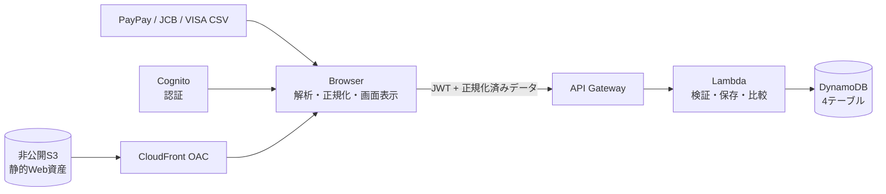

# SpendOps Dashboard

SpendOps Dashboardは、PayPayとクレジットカードの利用明細CSVをブラウザで読み込み、月別・年間・全期間の支出を集計し、自分の過去や匿名化された集団平均との差を確認できるWebアプリです。

対象はPayPayとクレジットカードです。現行実装はPayPay、JCB、三井住友VISAに対応し、銀行CSVは対象外です。AWS基盤はTerraformで構築・管理します。

> [!IMPORTANT]
> 2026-09-11にユーザー承認済みの保存済みDestroy Planを適用し、Terraform管理のAWS基盤42リソースを削除しました。現在のTerraform stateは0件で、公開サイト、API、認証、クラウド保存は停止しています。

最終精査日: 2026-09-11

## 現在の状態

| 項目 | 状態 |
|---|---|
| 対象データ | PayPay、クレジットカード（JCB・三井住友VISA） |
| 対象外 | 横浜銀行を含む銀行CSV、AWS料金分析 |
| 主機能 | CSV解析、支出レポート、比較、明細復元、分類学習まで実装済み |
| 公開サイト | 2026-09-11のDestroyでCloudFrontとS3を削除済み。現在は利用不可 |
| API・認証・DB | API Gateway、Lambda、Cognito、DynamoDBを削除済み |
| Terraform state | 0エントリ。承認済みPlanで42リソースを削除済み |
| 独自ドメイン | ACM証明書はDestroy前にAWS上で削除済み。Cloudflare DNSはTerraform管理外 |
| 自動テスト | フロントエンド47件、Lambda 24件、合計71件成功 |
| 新デモ動画 | レビュー指摘1〜3を反映した17区間の音声と焼き込み字幕を割り当てた修正版MP4を生成済み。5分00秒の全編デコード、字幕表示、分類説明と締めの開始時刻、登録中の無音短縮を確認済み |
| 直近の目標 | 2026-09-07の学校課題提出に向けて仕上げる |

  SpendOps_Dashboardで○○を修正して　リポジトリ内のAGENTS.mdに従い、対象箇所だけを確認してください。一括検証とサブエージェントは、必要な場合だけ使用して

  1. 作業単位ごとに新しいチャットにする
  2. AGENTS.mdを貼り付けず、ローカルファイルを参照させる
  3. 推論量をlowまたはmediumにする
  4. 「対象テストだけ」「一括検証不要」と指定する
  5. AGENTS.md内の重複規則を整理する


残りの作業、デモ動画の作成
支払い別、CSVの取得方法ページ作成
## 解決する課題

支払い元が複数あると、利用明細を個別に見ても「何に、いつ、合計いくら使ったか」を把握しにくくなります。本アプリは次の流れを一つの画面にまとめます。

1. PayPay・カードのCSVを任意のタイミングで選択する
2. CSVをブラウザ内で解析・正規化する
3. 月別、直近1年間、全期間の支出を集計する
4. 使いみち、月ごとの変化、比較結果、確認すべき明細を表示する
5. ログイン中は正規化済み明細、月別集計、分類ルールを本人用領域へ保存する

完全自動の家計簿ではなく、任意取込によってその日までの支出を振り返る分析ダッシュボードです。

## 対応CSV

| 対象 | 文字コード・形式 | 取込方法 | 状態 |
|---|---|---|---|
| PayPay | UTF-8、ヘッダー行あり | CSVアップロード | 対応済み |
| JCB | Shift_JIS、先頭メタ情報の後に明細ヘッダー | CSVアップロード | 対応済み |
| 三井住友VISA | Shift_JIS、メタ情報を含む固定列形式 | CSVアップロード | 対応済み |
| 銀行 | - | - | 対象外 |

UTF-8での読取に失敗した場合はShift_JISを試します。複数ファイルを一度に選択でき、別々に読み込んだPayPayとカードも現在のセッション内で統合します。

収入行は支出集計から除外します。現在のMVPは支出分析に限定しています。

## 主な機能

### 支出レポート

- 「まとめて」「PayPayだけ」「カードだけ」の表示切替
- 月別、直近12か月、読み込んだ全期間の集計
- 支出総額、1か月平均、取引件数、前月比
- 固定11カテゴリによる使いみちの内訳
- 月ごとの支出推移と金額目盛り
- 支出増加を赤、減少を青で示す符号・説明付き表示
- 「注目」「見方」「次の一歩」に分けた分析コメント

固定カテゴリは、食費、日用品、交通費、娯楽、光熱費、通信費、医療費、衣服費、住居費、ネットでの購入、その他です。

### 比較分析

| 比較方法 | 内容 | 条件 |
|---|---|---|
| 実ユーザー比較 | 本人を除く同月の月間支出平均と比較 | `partial=false`の他5人以上 |
| 自分の過去との比較 | 過去の完全月の平均と比較 | 最大12か月 |
| 合成参考値 | 実ユーザーが不足する場合の参考比較 | 実統計ではないことを画面に明記 |

実ユーザー比較では支払い種別を条件にせず、同じ月にPayPayまたはカードの保存済み集計がある他ユーザーを数えます。同じ人に複数の支払い種別がある場合は同月分を合算し、1人として扱います。期間途中の月は実比較の対象から除外します。

### 明細と分類

- 明細の日付、利用先、カテゴリ、支払い元、金額を表示
- 月・全期間と利用先による絞り込み
- コンビニの支店名や表記揺れをチェーン単位に統合
- 絞り込み後の合計金額と件数を表示
- 同じ利用先・支払い元のカテゴリを一括変更
- 「その他」の分類修正CSVを書き出し・読み戻し
- Amazon、Apple、Google、楽天市場などを「ネットでの購入」へ分類
- 本人専用の分類ルールを次回取込へ優先適用
- 分類学習の控えを端末へ書き出し、再構築後に読み戻し

### 認証と保存

- Cognitoによる新規登録、メール確認、ログイン、ログアウト
- 登録時に匿名集計の比較利用への同意を取得
- ID・Access・Refresh Tokenは`sessionStorage`だけに保持
- 本人の正規化済み明細を最大5,000件まで再取得
- 保存済み明細からPayPay・カード統合、年間レポート、利用先絞り込みを復元
- JWTで一般ユーザーのデータを本人単位に分離
- Cognitoの`users`と`admins`グループを分離

## システム構成

次の構成をTerraformで定義しています。現在は第1段階を再構築済みで、CloudFront既定ドメインを使用しています。独自ドメインだけは未有効です。



CSV原本の解析はブラウザ内で完結します。AWSへ送るのは、画面復元と集計に必要な正規化済みデータだけです。

## データとプライバシー

### 保存対象

| 保存先 | 主な内容 |
|---|---|
| `transactions` | 本人ID、取引日、金額、正規化した利用先、固定カテゴリ、支払い元、取込ID |
| `user_monthly_summaries` | 月、支払い種別、支出総額、件数、カテゴリ別・支払い方法別集計、暫定フラグ |
| `import_batches` | 取込ID、対象月、保存件数、検証件数、同意バージョン、取込日時 |
| `category_rules` | 本人ID、支払い元、固定カテゴリ、利用先照合用SHA-256値 |
| Cognito | 認証に必要なアカウント情報 |

各DynamoDBテーブルは本人のCognito IDで分離します。分類ルール用テーブルには利用先名そのものを保存しません。

### 保存しないデータ

- CSV原本、ファイル名、未加工行
- カード番号、口座番号、パスワード、確認コード
- 氏名、商品名、メール本文全文
- 分類修正CSVや分類学習の控えそのもの
- CloudWatch Logsへのリクエスト本文・取引内容

利用先に7〜19桁の連続数字が含まれる場合は、Lambdaで保存前に`[redacted]`へ置換します。CSV取引番号はAWSへ送らず、正規化項目と同一明細の出現順から決定的な取引キーを生成します。

## API

### 公開ルート

| Method | Path | 用途 |
|---|---|---|
| GET | `/health` | APIの死活確認 |
| GET | `/demo/report` | 合成データによるデモレポート |

### Cognito JWT必須ルート

| Method | Path | 用途 | 実装状態 |
|---|---|---|---|
| POST | `/imports` | 正規化済み明細と月別集計を保存 | 実装済み |
| GET | `/reports` | 本人の月別集計一覧を取得 | 実装済み |
| GET | `/reports/{month}` | 本人の月別集計と匿名比較を取得 | 実装済み |
| GET | `/transactions` | 本人の明細を最大5,000件取得 | 実装済み |
| GET | `/category-rules` | 本人の分類ルールを取得 | 実装済み |
| PUT | `/category-rules` | 本人の分類ルールを追加・更新 | 実装済み |
| GET | `/admin/imports` | 管理者が取込バッチ総数を確認 | 実装済み |
| DELETE | `/users/me` | 退会処理 | 安全のため未有効化。HTTP 501を返す |

`/admin/imports`は`admins`グループだけが利用できます。現在取得できるのは取込バッチ総数のみです。

## 現在のAWS・バックアップ状態

2026-07-23に旧環境を削除し、2026-09-07に本番環境（`prod`）を再構築しました。2026-09-11に削除保護を解除した後、SHA-256 `E05E92D13FCB1FB0187F376A73ABACF67B5832AF24FB359FBC1ABE4AFDFD4BD8`の保存済みDestroy Planをユーザー承認後に適用し、Terraform管理の42リソースを削除しました。

| 項目 | 状態 |
|---|---|
| AWSリージョン | `ap-northeast-1` |
| Terraform state | 0エントリ |
| 最新の削除記録 | 0件追加、0件変更、42件削除。ローカルstateバックアップを保持 |
| 直前の構築記録 | 2026-09-07に管理リソース43件を追加。Apply後の再Planは差分0 |
| 旧環境の削除時記録 | 個別取引3,477件、月別集計60件、取込履歴17件、分類ルール0件、Cognitoユーザー3件 |
| 長期バックアップ | `spendops-anonymized-comparison-20260723` |
| 長期バックアップ内容 | 匿名化済み月別集計60件、匿名参加者3人分 |
| Cloudflare DNS | Terraform管理外。今回のDestroyでは変更・削除していない |

長期バックアップには、個別取引、利用先、取込履歴、分類ルール、Cognito情報、元ユーザーID、匿名IDとの対応表を含めていません。詳細は[`implementation/docs/operations/anonymized_comparison_backup.md`](implementation/docs/operations/anonymized_comparison_backup.md)を参照してください。

旧AWSアカウントにあった未匿名のDynamoDBシステムバックアップ8件は、4件が2026-08-19、残り4件が2026-08-27に自動失効する予定でした。2026-09-02時点では旧アカウントへアクセスできないため、失効状態は要再確認です。復元やコピーは行いません。

匿名参加者は3人のため、長期バックアップ単体では「他5人以上」の実比較条件を満たしません。

## ディレクトリ構成

| パス | 内容 |
|---|---|
| `implementation/app-site/` | HTML・CSS・JavaScript製のWebアプリ、認証、比較用合成データ |
| `implementation/lambda/` | API Gatewayから呼び出すPython Lambdaとテスト |
| `implementation/terraform/` | Cognito、DynamoDB、Lambda、API Gateway、S3、CloudFront、ACM等の定義 |
| `implementation/csv/` | ローカル検証用CSV。金融情報として慎重に扱い、内容をログや資料へ転記しない |
| `implementation/portfolio-site/` | 別途作成したポートフォリオ用静的サイト |
| `C:\development\SpendOps_Dashboard_Material\` | リポジトリ外へ分離した現行AWS構成図、最新の完成デモ動画、紹介サイト |
| `project-guidance/` | 短い現在コンテキストとアクティブガードレール、現在引継ぎ、履歴、資料作成用プロンプト |
| `.agents/` / `.codex/` | リポジトリスキル、カスタムエージェント、Codexプロジェクト設定 |

## ローカルでの確認

### 前提環境

今回の精査で使用した環境は次のとおりです。

- Node.js 20.19.1
- Python 3.12.7
- Terraform 1.15.8

### 画面を開く

リポジトリのルートで次を実行します。

```powershell
python -m http.server 3000 --directory implementation/app-site
```

ブラウザで`http://localhost:3000`を開きます。リポジトリ内の`implementation/app-site/config.js`は空設定のため、このローカル起動ではログインとクラウド保存を使えませんが、CSVのローカル解析と画面表示は確認できます。CloudFrontへ配置したサイトにはTerraformが生成した設定を使用します。

実CSVには金融情報が含まれ得ます。画面共有、スクリーンショット、ログ、ドキュメントへ内容を残さないでください。

## テスト

### フロントエンド

```powershell
node implementation/app-site/tests/analysis.test.js
node implementation/app-site/tests/auth.test.js
node implementation/app-site/tests/generated-comparison.test.js
node --check implementation/app-site/script.js
```

2026-09-02の結果: 38件 + 4件 + 5件、合計47件成功。JavaScript構文確認も成功。

### Lambda

```powershell
python -B -m unittest discover -s implementation/lambda/tests -p 'test_*.py'
```

2026-09-02の結果: 24件成功。

### Terraform

初回確認時は、先に`terraform init`を実行してください。既存の初期化済み環境では次を確認します。

```powershell
Set-Location implementation/terraform
terraform fmt -check
terraform validate
terraform state list
```

2026-09-07の結果: フォーマット確認成功、構成検証成功、stateは48エントリ、`activate_custom_domain = false`の再Planは差分0。

## AWS再構築

Terraform定義は[`implementation/terraform/README.md`](implementation/terraform/README.md)にまとめています。再構築はAWS料金、公開範囲、認証、保存先へ影響するため、必ず新しいPlanを確認し、ユーザー承認後に実施します。

再構築時の要点:

1. 過去の`.tfplan`を再利用せず、現在のコードから新しいPlanを作る
2. 最初は`activate_custom_domain = false`で基盤とACM証明書を作る
3. Cloudflareの検証用CNAMEとTerraform outputを照合する
4. 証明書発行後に`activate_custom_domain = true`でCloudFrontへ接続する
5. 公開用`cache` CNAMEを新しいCloudFrontドメインへ更新する
6. AWS変更・Apply・デプロイは事前承認後に行う

Cloudflareの認証情報やAPIトークンはTerraform、Git、資料へ保存しません。詳細は[`implementation/docs/operations/custom_domain_cloudflare_setup.md`](implementation/docs/operations/custom_domain_cloudflare_setup.md)を参照してください。

## 既知の制限と残作業

- AWS基盤は2026-09-11にDestroy済みで、公開サイト、API、認証、クラウド保存は現在利用できない
- 銀行CSVは対象外
- PayPay、JCB、VISAの返金・取消表現は実例による追加検証が必要
- PayPayチャージとカード明細のような異なるソース間の二重計上は自動解消しない
- 1回の保存と明細再取得は最大5,000件
- ソース別の最終取込日と未取込警告は、データには取込日時があるが画面表示は未実装
- 不正行は件数で表示するが、失敗行番号と行別理由の表示は未実装
- 退会APIは誤操作防止のためHTTP 501で無効化中
- 管理者機能は取込バッチ総数の確認のみで、管理画面や詳細エラー確認は未実装
- 比較用合成データは実統計ではなく、元データが少ないため参考値としての精度に限界がある
- 収入、資産推移、予算管理は未実装
- デザイン、情報密度、分類精度、テストデータの仕上げが残っている
- AWSを再構築する場合は、新しいPlanと公開範囲を確認し、明示承認後に適用する必要がある

## 完了条件

### 実装済み

- [x] PayPay、JCB、三井住友VISA CSVをブラウザ内で解析できる
- [x] 月別、年間、全期間の支出レポートを表示できる
- [x] PayPayとカードを統合し、支払い種別ごとにも表示できる
- [x] 月間支出、件数、前月比、カテゴリ、推移、分析コメントを表示できる
- [x] 期間途中と支払い元不足の月を「一部期間」として区別できる
- [x] Cognito認証と本人別保存を実装している
- [x] 正規化済み個別取引、月別集計、取込履歴、分類ルールを保存できる
- [x] 保存済み明細から年間レポートと利用先絞り込みを復元できる
- [x] 条件を満たす他ユーザーとの匿名比較を実装している
- [x] CSV原本、未加工行、カード番号、口座番号、認証情報をAWSへ保存しない
- [x] フロントエンド47件、Lambda 24件のテストが成功する
- [x] TerraformでAWS基盤を構築できる構成がある

### 仕上げ対象

- [ ] デザイン修正を完了する
- [ ] 自動分類と表記揺れ対応の精度を強化する
- [ ] Notion・企画資料を最新状態へ同期する
- [x] 約20分の自由閲覧向け展示スライドと、別紙の技術解説を作成する
- [x] 展示資料PPTXをネイティブGoogle Slidesへ取り込み、実画面を反映する
- [x] 技術解説DOCXをGoogle Docsへ取り込み、Google Slidesからのリンクを設定する
- [x] CloudFrontサイト、`GET /health`、`GET /demo/report`の200と、未認証APIの401を確認する
- [ ] Cognitoユーザーによるログイン、保存、再取得の公開E2Eを確認する

## 関連資料

| パス | 内容 | 現在の注意 |
|---|---|---|
| [`project-guidance/current-context.md`](project-guidance/current-context.md) | Codex向けの短いプロジェクト概要と現在状態 | 通常作業の開始時に確認 |
| [`project-guidance/active-guardrails.md`](project-guidance/active-guardrails.md) | 常時適用する安全規則と実行境界 | 通常作業の開始時に確認 |
| [`project-guidance/current-handoff.md`](project-guidance/current-handoff.md) | 現在の停止地点、次回作業、未決事項 | 現在状態が関係する場合に確認 |
| [`project-guidance/history/`](project-guidance/history/) | 詳細な日別・月別作業履歴 | 必要な日付・語句だけ検索 |
| [`implementation/docs/operations/anonymized_comparison_backup.md`](implementation/docs/operations/anonymized_comparison_backup.md) | 匿名比較バックアップの保持・復元方針 | 長期バックアップの正本 |
| [`implementation/terraform/README.md`](implementation/terraform/README.md) | AWS構成、API、Terraform操作 | Apply前の承認が必要 |
| [`implementation/docs/operations/custom_domain_cloudflare_setup.md`](implementation/docs/operations/custom_domain_cloudflare_setup.md) | 独自サブドメイン再接続手順 | 新しいoutputを正とする |
| `C:\development\SpendOps_Dashboard_Material\architecture\spendops_aws_architecture.drawio` | AWS公式リファレンス図に合わせ、矩形の境界グループ、64px角の公式アイコン、左から右への通信方向を統一したAWS構成図 | PNG・SVG・設計sidecarと一緒に保持 |
| `C:\development\SpendOps_Dashboard_Material\deliverables\SpendOps_Dashboard_5分デモ動画_音声・字幕付き_修正版.mp4` | 1920×1128、5分00秒、17区間の日本語ナレーションと焼き込み字幕付き動画 | リポジトリ外の資料フォルダーで保持。全編デコードと冒頭・中盤・終盤の字幕表示を確認済み |
| `C:\development\SpendOps_Dashboard_Material\introduction-site\` | Google Sites版の録画と指定背景を基準に、5分動画、企画書PDF、AWS構成図、開発理由から製作上の工夫までを掲載する1ページサイト | ローカルHTTP 200、動画Range配信206、企画書PDFの`application/pdf`配信を確認済み。ローカル版は更新済みで、外部公開は未実施 |

旧説明資料、旧動画、制作中間物は2026-09-09のプロジェクト整理で削除しました。説明資料は現行仕様から新規作成します。

詳細な日別作業ログはREADMEへ重複させず、`project-guidance/history/YYYY-MM.md`で管理します。現在の停止地点と次回作業だけを`project-guidance/current-handoff.md`へ反映します。

## 主要な履歴

- 2026-07-08: 個人用家計簿から複数ユーザーCSV比較分析サービスへ方針変更
- 2026-07-15: CSV分析、Cognito認証、DynamoDB月別保存、匿名比較、全支払い統合を実装・公開
- 2026-07-22: 個別取引保存、年間集計、利用先絞り込み、分類修正、本人別分類学習を実装・公開
- 2026-07-23: ユーザー承認後にAWS基盤42リソースを削除し、匿名化済み月別集計だけを長期バックアップ
- 2026-07-23: 展示会形式の約20分自由閲覧を想定した12枚の本編PPTXと、技術解説DOCXを作成。PowerPoint実描画、Open XML構造、70件の自動テストを再確認
- 2026-09-02: 新しいAWSアカウントへTerraform第1段階を再構築。43リソースを追加し、CloudFront既定ドメイン、API、Cognito、DynamoDB、Lambdaを検証。独自ドメインはACM検証待ち
- 2026-09-03: 実ユーザー比較を支払い種別で分けず、本人を除く同月の完全月集計を利用者単位で合算する変更をデプロイ。Terraform Applyは0件追加、4件変更、0件削除で、Lambdaと公開画面の`auth.js`、`script.js`、`styles.css`を更新。DynamoDB、Cognito、IAM、APIルート、CloudFront設定、独自ドメインは変更していない。公開サイト、公開API、認証必須APIの未認証拒否を確認し、認証後の実比較成立ケースは公開E2E未確認
- 2026-09-07: 本番環境（`prod`）の第1段階をstate 0件から構築。管理リソース43件、data 5件をstateで確認し、公開サイトと公開APIは200、認証必須APIの未認証アクセスは401、再Planは差分0を確認。独自ドメインはACMのDNS検証待ち

## 既存の利用者フィードバック

> この節は使用者による不満点メモです。Codexは内容を改変しません。

- ~~ボタンが一部分だけ黒い~~
- ~~画面ガチガチで見にくい~~
- ~~比較平均がダミーデータだし月ごとで平均を出しているから全データを比較してその平均で出したいそれかダミーデータの内容にもっと差を出したい今現在私の支払いの差が大きすぎて参考にならない~~
- ~~googleでの支払いは娯楽に分類~~
- ~~支払い方法で未登録のものが出てきたときにすべてその他で分類してしまうので正確な結果が出ない~~
- ~~ある程度はサイト側で分類しどうしても不明なものだけより細かく分析したい人だけ分類できるようにしたい以降その人が設定した項目にそれが振り分けられるようにしたい~~
- ~~DBに保存していないからか支払い方法が読み込んだファイルのみなので今のところ意味がない~~
- ~~分析がしょぼい~~
- ~~テストデータが薄い~~
- 分析内容が事実の列挙なので必要性が薄い

## 残り作業

### googleスライドを使い　開発物の概要の紹介

紹介サイトは`C:\development\SpendOps_Dashboard_Material\introduction-site\`へ分離済み。Googleスライドは未作成です。

- その開発物を開発しようと思った理由
- 課題と解決法
- 技術選定の妥当性
- システムの網羅性(ちゃんと動作を行えるか)
- 今後の課題、追加実装予定のもの

### デザインの改修

- ~~アイコンの追加~~

#### 比較方法の切替表示（公開環境へ反映済み）

比較ロジックは変えず、比較方法と現在の比較対象を判別しやすくする表示改善を2026-09-03に実装し、2026-09-07の本番構築で公開環境へ反映した。

- 2つの選択肢を、それぞれ独立した枠を持つ横並びの選択カードとして表示する
- 表示文言は「みんなの月平均／他5人以上の完全月」と「自分の過去平均／最大12か月の平均」とする
- 選択中のカードにはチェックマークと「選択中」を表示し、色に加えて枠線と文字でも状態を示す
- 比較金額カードには「比較対象：みんなの月平均」など、現在の比較対象を重複なく常時表示する
- 比較金額カードと差分表示は中立色にし、黄緑の主な強調を選択中カードへ集約する
- ダッシュボードの補助文字を原則11px以上にし、分析欄の見出し・項目・グラフ軸を拡大する
- 分析欄から装飾的な「NEXT ACTION」を削除し、PCの分析領域を270～340pxに抑えて余白を減らす
- レポート上部はPCで「レポート、表示する期間、見る範囲、比較法、明細操作」の順に横並びとし、比較ボタンを領域内で2等分して各グループを等間隔に配置する
- `aria-pressed`とネイティブボタンによるキーボード操作を維持し、文字の折り返しと狭幅時の横並びに対応する
- 関連するフロントエンドテストは47件成功し、JavaScript構文確認も成功した
