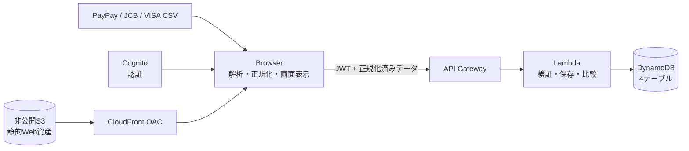

# SpendOps Dashboard

SpendOps Dashboardは、PayPayとクレジットカードの利用明細CSVをブラウザで読み込み、月別・年間・全期間の支出を集計し、自分の過去や匿名化された集団平均との差を確認できるWebダッシュボード

対象はPayPayとクレジットカード。現行実装はPayPay、JCB、VISAに対応し、銀行CSVは対象外。AWS基盤はTerraformで構築・管理。

> [!稼働状況]
>　現在は停止中

個人開発のプロジェクト。
[紹介ページ](https://yuduki0303.com/spendops/)でデモ動画などの資料を公開中。  
公開しているデータはダミーデータ。

## 開発の背景

クレジットカードやPayPayで支払う際、お金を使っている実感が薄く、使いすぎてしまうことがありました。そこで、複数のキャッシュレス決済の支払い情報を一元化し、支出を振り返れるダッシュボードを作ろうと考えました。

当初は自分の支出を集計する機能を想定していましたが、AWSで構築するにあたり、個人の集計だけではクラウドを活用する理由が弱いと感じ、複数の利用者の支出を匿名の集計情報として扱い、他者との比較もできる機能へと構想を広げました。

## 試用とフィードバック

学校の知人向けに約1週間公開し、20人分の実際の決済データを読み込んで動作を確認しました。以下は、その際に寄せられた感想の要約です。

- 自分がこれほどお金を使っていたことを知らなかった。
- 明細まで確認できるので、支払いを振り返る際に便利だった。
- グラフで支出の割合を見られ、何に使っているのかを一目で把握できた。

一方で、実際の決済データを取り込むことへの抵抗や、自分の明細がほかの利用者に見られないかという不安も寄せられました。  
データの保存範囲や閲覧権限を、利用者が理解したうえで使えるように説明することが課題として残っています。

## 現在の状態

| 項目 | 状態 |
|---|---|
| 対象データ | PayPay、クレジットカード（JCB・VISA） |
| 対象外 | 銀行CSV、 他クレジット会社の出力ＣＳＶ|
| 主機能 | CSV解析、支出レポート、比較、明細復元、分類学習 |
| 公開サイト | cloud frontを使用して公開  **現在は停止中** |
| API・認証・DB | API Gateway、Lambda、Cognito、DynamoDB |
| Iac | Terraformを使用して構築・管理 |
| 関連資料 | [紹介ページ](https://yuduki0303.com/spendops/)で公開中 |
| 開発体制 | 個人開発 |
| 試用実績 | 学校の知人向けに約1週間公開し、20人分の実データで動作を確認 |

## 解決する課題

支払い元が複数あると、利用明細を個別に見ても「何に、いつ、合計いくら使ったか」を把握しにくくなり、支出の管理が難しい。

1. PayPay・カードのCSVを任意のタイミングで選択する
2. CSVをブラウザ内で解析・正規化する
3. 月別、直近1年間、全期間の支出を集計する
4. 使いみち、月ごとの変化、比較結果、確認すべき明細を表示する
5. ログイン中は正規化済み明細、月別集計、分類ルールを本人用領域へ保存する

完全自動の家計簿ではなく、  
任意取込によってその日までの支出を振り返る分析ダッシュボードです。

## 対応CSV

| 対象 | 文字コード・形式 | 取込方法 | 状態 |
|---|---|---|---|
| PayPay | UTF-8、ヘッダー行あり | CSVアップロード | 対応済み |
| JCB | Shift_JIS、先頭メタ情報の後に明細ヘッダー | CSVアップロード | 対応済み |
| 三井住友VISA | Shift_JIS、メタ情報を含む固定列形式 | CSVアップロード | 対応済み |

UTF-8での読取に失敗した場合はShift_JISを試し、複数ファイルを一度に選択できる、別々に読み込んだPayPayとカードも現在のセッション内で統合を行う。

    paypayの受取金額などの収入は、今回の支出監理では除外して計算を行う。

## 主な機能

### 支出レポート

- 「まとめて」「PayPayだけ」「カードだけ」の表示切替
- 月別、直近12か月、読み込んだ全期間の集計
- 支出総額、1か月平均、取引件数、前月比
- 固定11カテゴリによる使いみちの内訳
- 月ごとの支出推移と金額目盛り
- 支出増加を赤、減少を青で示す符号・説明付き表示
- 「注目」「見方」「次の一歩」に分けた分析コメント

固定カテゴリは、食費、日用品、交通費、娯楽、光熱費、通信費、医療費、衣服費、住居費、ネットでの購入、その他

### 比較分析

| 比較方法 | 内容 | 条件 |
|---|---|---|
| 実ユーザー比較 | 本人を除く同月の月間支出平均と比較 | `partial=false`の他5人以上 |
| 自分の過去との比較 | 過去の完全月の平均と比較 | 最大12か月 |
| 合成参考値 | 実ユーザーが不足する場合の参考比較 | 実統計ではないことを画面に明記 |

実ユーザー比較では支払い種別を条件にせず、同じ月にPayPayまたはカードの保存済み集計がある他ユーザーを数える。同じ人に複数の支払い種別がある場合は同月分を合算し、1人として扱い、期間途中の月は実比較の対象から除外する。

### 明細と分類

- 明細の日付、利用先、カテゴリ、支払い元、金額を表示
- 月・全期間と利用先による絞り込み
- コンビニの支店名や表記揺れをチェーン単位に統合
- 絞り込み後の合計金額と件数を表示
- 同じ利用先・支払い元のカテゴリを一括変更
- 「その他」の分類修正CSVを書き出し・読み戻し
- Amazon、Apple、Google、楽天市場などを「ネットでの購入」へ分類
- 本人専用の分類ルールを次回取込へ優先適用
- 分類学習の控えを端末へ書き出し、再構築後に読み戻し

### 認証と保存

- Cognitoによる新規登録、メール確認、ログイン、ログアウト
- 登録時に匿名集計の比較利用への同意を取得
- ID・Access・Refresh Tokenは`sessionStorage`だけに保持
- 本人の正規化済み明細を最大5,000件まで再取得
- 保存済み明細からPayPay・カード統合、年間レポート、利用先絞り込みを復元
- JWTで一般ユーザーのデータを本人単位に分離
- Cognitoの`users`と`admins`グループを分離

## システム構成

次の構成をTerraformで定義している、アプリ用のAWS基盤は削除済みで、現在は稼働していない。

```mermaid
flowchart LR
    CSV[PayPay / JCB / VISA CSV] --> Browser[Browser\n解析・正規化・画面表示]
    Cognito[Cognito\n認証] --> Browser
    Browser -->|JWT + 正規化済みデータ| API[API Gateway]
    API --> Lambda[Lambda\n検証・保存・比較]
    Lambda --> DDB[(DynamoDB\n4テーブル)]
    S3[(非公開S3\n静的Web資産)] --> CF[CloudFront OAC]
    CF --> Browser
```

CSV原本の解析はブラウザ内で完結します。AWSへ送るのは、画面復元と集計に必要な正規化済みデータだけです。

## データとプライバシー

### 保存対象

| 保存先 | 主な内容 |
|---|---|
| `transactions` | 本人ID、取引日、金額、正規化した利用先、固定カテゴリ、支払い元、取込ID |
| `user_monthly_summaries` | 月、支払い種別、支出総額、件数、カテゴリ別・支払い方法別集計、暫定フラグ |
| `import_batches` | 取込ID、対象月、保存件数、検証件数、同意バージョン、取込日時 |
| `category_rules` | 本人ID、支払い元、固定カテゴリ、利用先照合用SHA-256値 |
| Cognito | 認証に必要なアカウント情報 |

各DynamoDBテーブルは本人のCognito IDで分離、分類ルール用テーブルには利用先名そのものを保存ない

### 保存しないデータ

- CSV原本、ファイル名、未加工行
- カード番号、口座番号、パスワード、確認コード
- 氏名、商品名、メール本文全文
- 分類修正CSVや分類学習の控えそのもの

利用先に7〜19桁の連続数字が含まれる場合は、Lambdaで保存前に`[redacted]`へ置換、CSV取引番号はAWSへ送らず、正規化項目と同一明細の出現順から取引キーを生成。

## ディレクトリ構成

| パス | 内容 |
|---|---|
| `implementation/app-site/` | HTML・CSS・JavaScript製のWebアプリ、認証、比較用合成データ |
| `implementation/lambda/` | API Gatewayから呼び出すPython Lambdaとテスト |
| `implementation/terraform/` | Cognito、DynamoDB、Lambda、API Gateway、S3、CloudFront、ACM等の定義 |
| `implementation/csv/` | 公開用ダミーCSVとデータ生成用スクリプト |
| `implementation/portfolio-site/` | 別途作成したポートフォリオ用静的サイト |
| `project-guidance/` | 短い現在コンテキストとアクティブガードレール、現在引継ぎ、履歴、資料作成用プロンプト |
| `.agents/` / `.codex/` | リポジトリスキル、カスタムエージェント、Codexプロジェクト設定 |

### 構築環境

- Node.js 20.19.1
- Python 3.12.7
- Terraform 1.15.8

## 実装状況と今後の課題

### 実装済み

- [x] PayPay、JCB、三井住友VISA CSVをブラウザ内で解析できる
- [x] 月別、年間、全期間の支出レポートを表示できる
- [x] PayPayとカードを統合し、支払い種別ごとにも表示できる
- [x] 月間支出、件数、前月比、カテゴリ、推移、分析コメントを表示できる
- [x] 期間途中と支払い元不足の月を「一部期間」として区別できる
- [x] Cognito認証と本人別保存を実装している
- [x] 正規化済み個別取引、月別集計、取込履歴、分類ルールを保存できる
- [x] 保存済み明細から年間レポートと利用先絞り込みを復元できる
- [x] 条件を満たす他ユーザーとの匿名比較を実装している
- [x] CSV原本、未加工行、カード番号、口座番号、認証情報をAWSへ保存しない
- [x] フロントエンド47件、Lambda 24件のテストが成功する
- [x] TerraformでAWS基盤を構築できる構成がある

### 今後の課題

- 利用者から寄せられた個人情報の扱いへの不安に対応し、保存範囲と閲覧権限を分かりやすく説明する（未対応）
- 自動分類と表記揺れ対応の精度を強化する
- 支出の事実の列挙にとどまらず、振り返りに役立つ分析コメントを改善する
- AWSを再構築する場合は、ログイン、保存、再取得、実ユーザー比較の公開E2Eを確認する

