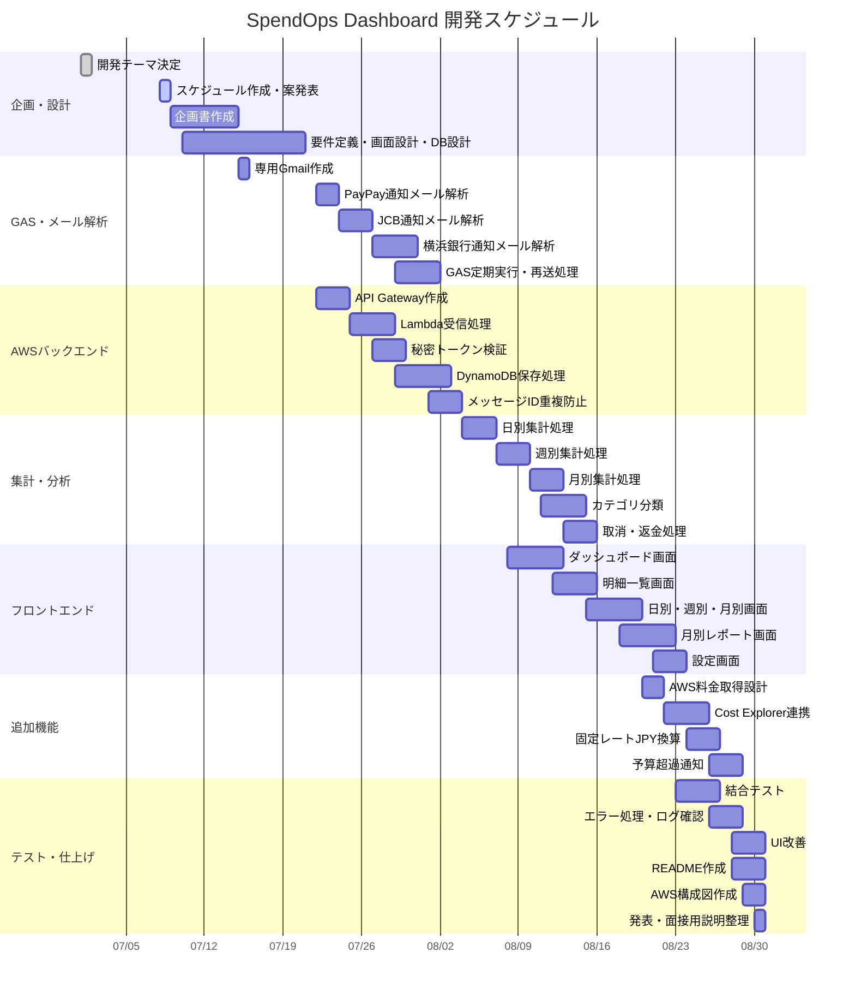

# SpendOps Dashboard 開発計画書

## 0. Codexへの指示

このMarkdownの内容をもとに、Notionに整理された開発ドキュメントを作成してください。

Notionでは以下のページ構成にしてください。

1. プロジェクト概要
2. 開発目的・背景
3. アプリの全体像
4. システム構成
5. 機能一覧
6. 決定事項
7. 未解決課題
8. DB設計
9. GAS設計
10. AWS設計
11. 画面設計
12. セキュリティ設計
13. 開発スケジュール
14. 面接での説明内容
15. 次にやること

表にできる部分はNotionのテーブル形式にしてください。
チェックリストにできる部分はToDo形式にしてください。
構成図はMermaid、またはテキスト図として見やすく整形してください。

---

# 1. プロジェクト概要

## アプリ名

候補：

- SpendOps Dashboard
- Personal Cost Analyzer
- Life Cost Dashboard
- Life & Cloud Cost Manager

現時点では **SpendOps Dashboard** を仮称とする。

## 概要

PayPay、横浜銀行、JCBカードの支払い通知メールを専用Gmailで受け取り、Google Apps Script（GAS）で自動解析してAWSへ送信する。  
AWS側ではAPI Gateway、Lambda、DynamoDBを使って明細データを保存し、日別・週別・月別の支出を自動集計する。

また、余裕があればAWS Cost Explorer APIを使ってAWS利用料金も取得し、日常支出とクラウド利用料金をまとめて可視化する。

## コンセプト

AWSのコスト分析だけでは用途が限定的になるため、日常の支出とAWS利用料金をまとめて分析できるシステムにする。

単なる家計簿ではなく、以下を重視する。

- 支払い通知メールの自動取得
- 手作業を極力減らした支出集計
- AWSサーバーレス構成
- セキュリティに配慮した金融情報の扱い
- 日別・週別・月別の可視化
- 月別レポートによる振り返り
- NHNテコラスの事業内容に近い「コスト可視化」「データ活用」「自動化」「クラウド運用」の要素を含める

---

# 2. 開発目的・背景

## 背景

NHNテコラスへの就職を意識し、同社の事業内容と近いテーマでAWSを使った個人開発を行いたい。

NHNテコラスはクラウド活用、クラウド運用、コスト最適化、FinOps、データ活用、セキュリティなどに関わる事業を行っている。  
そのため、AWSを利用した「コスト可視化」「支出分析」「自動化」をテーマにした開発は志望先との関連性を説明しやすい。

## 解決したい課題

日常の支出はPayPay、クレジットカード、銀行など複数のサービスに分散している。  
そのため、日別・週別・月別でどのくらい使ったかを把握しにくい。

また、AWSを使った個人開発を進める中で、AWS利用料金も別で管理する必要がある。

そこで、生活費とAWS利用料金をまとめて可視化し、支出状況を自動集計できる仕組みを作る。

## 目標

- 会計後に届く通知メールをもとに支出を自動記録する
- ユーザーの手入力やCSVアップロード作業をできるだけ減らす
- 日別・週別・月別で支出を集計する
- 支払い方法別、カテゴリ別に支出を分析する
- 月別レポートで支出の振り返りを行う
- AWSサーバーレス構成を使って実装する
- 金融情報を扱うため、必要最小限の情報のみ保存する

---

# 3. 対象サービス

初期段階では、以下の3社に絞る。

| 対象 | 用途 | 取得方法 |
|---|---|---|
| PayPay | キャッシュレス支払い | 利用通知メール |
| 横浜銀行 | 銀行口座の入出金通知 | 通知メール |
| JCBカード | クレジットカード利用通知 | 利用通知メール |

## 理由

最初から多くのサービスに対応すると、メール形式の違いにより実装が複雑になる。  
そのため、まずは自分が実際に利用している3社に限定し、確実に動く仕組みを作る。

---

# 4. 全体構成

## 支出データ連携フロー

```text
PayPay / 横浜銀行 / JCBカード
        ↓
専用Gmail
        ↓
GASが30分ごとに定期実行
        ↓
未処理メールを取得
        ↓
メール本文から日付・金額・支払先・支払い元を抽出
        ↓
JSONに整形
        ↓
API GatewayへPOST
        ↓
Lambdaで秘密トークン検証
        ↓
DynamoDBに保存
        ↓
日別・週別・月別集計
        ↓
Webダッシュボードで表示
```

## AWS料金連携フロー

```text
EventBridge
        ↓
Lambda
        ↓
Cost Explorer API
        ↓
AWS利用料金を取得
        ↓
固定レートでJPY換算
        ↓
DynamoDBに保存
        ↓
月別レポートに反映
```

---

# 5. 使用技術・AWSサービス

| 分類 | 使用技術・サービス | 役割 |
|---|---|---|
| メール取得 | Gmail | 支払い通知メールを受信 |
| メール解析 | Google Apps Script | メール本文を解析しAWSへ送信 |
| フロントエンド | React / Next.js など | ダッシュボード表示 |
| 静的ホスティング | S3 + CloudFront | フロントエンド配信 |
| 認証 | Cognito | ユーザーログイン |
| API | API Gateway | GASやフロントからのリクエスト受付 |
| 処理 | Lambda | データ保存、集計、分類 |
| DB | DynamoDB | 明細・集計・メッセージID保存 |
| ファイル保存 | S3 | 必要に応じてCSVやレポート保存 |
| 定期実行 | EventBridge | AWS料金取得や集計処理 |
| AWS料金取得 | Cost Explorer API | AWS利用料金の取得 |
| 通知 | SES / SNS | 予算超過や月次レポート通知 |
| ログ監視 | CloudWatch Logs | LambdaやAPIのログ確認 |
| 権限管理 | IAM | 最小権限でAWSサービスを利用 |

---

# 6. 決定事項

| No | 項目 | 決定内容 |
|---:|---|---|
| 1 | 初期対象サービス | PayPay、横浜銀行、JCBカード |
| 2 | メール形式の違い | 3社ごとに解析ルールを作成 |
| 3 | 重複対策 | DynamoDBにGmailメッセージIDを保存 |
| 4 | 返金・取消 | 取消として扱い、マイナス金額で保存 |
| 5 | カテゴリ分類 | ルールベースで分類 |
| 6 | AWS料金の円換算 | 固定レートでJPY換算 |
| 7 | 定期実行 | GASを30分ごとに定期実行し、失敗時は次回リトライ |
| 8 | API認証 | 秘密トークン方式 |
| 9 | 個人情報対策 | 必要最小限の情報だけ保存 |
| 10 | メール本文保存 | 本文全文は保存しない |
| 11 | 画面 | 最低限の画面に加えて月別レポートを作成 |
| 12 | 開発期間 | 2か月 |
| 13 | 開発時間 | 7月中は毎週水曜日に6時間、そのほか適宜確保 |
| 14 | メールアドレス | 専用Gmailを作成し、3社の通知を集約 |

---

# 7. 未解決課題

## 7.1 各社メールの実際の本文形式

PayPay、横浜銀行、JCBカードの通知メール本文を確認する必要がある。

確認項目：

- 送信元メールアドレス
- 件名
- 金額の書かれ方
- 利用日時の書かれ方
- 支払先の有無
- 取消・返金メールの形式
- 入金・出金の判定方法

## 7.2 横浜銀行通知で取得できる情報

銀行通知では、PayPayやJCBよりも詳細な支払先が分からない可能性がある。

対応方針：

- 取得できる範囲で保存する
- 支払先が不明な場合は `merchant = 不明` とする
- `source = YokohamaBank`
- `category = 銀行` または `未分類`

## 7.3 JCBの速報通知と確定通知の扱い

JCBカードでは、利用速報と確定明細の内容が異なる可能性がある。

初期方針：

- 利用通知メールを支出として登録
- 確定明細は初期段階では扱わない
- 取消メールが来た場合は `cancel` として相殺

## 7.4 AWS料金連携の実装タイミング

Cost Explorer API連携はできれば入れたいが、優先度は生活費集計より低い。

方針：

1. 生活費集計を先に完成させる
2. 余裕があればAWS Cost Explorer連携を追加
3. 難しければAWS料金は手動登録またはサンプルデータから始める

## 7.5 月別レポートの表示内容

月別レポートにどこまで含めるかは今後調整する。

候補：

- 今月の総支出
- 前月比
- 1日平均支出
- 最も支出が多いカテゴリ
- 最も使った支払い方法
- AWS利用料金
- 予算との差
- 取消・返金額
- 今月の振り返りコメント

---

# 8. GAS設計

## GASの役割

GASは以下の処理を行う。

1. 専用Gmailから未処理メールを検索
2. PayPay、横浜銀行、JCBカードの通知メールを判定
3. メール本文から必要項目を抽出
4. JSONに整形
5. API GatewayへPOST送信
6. 成功したら `spendops/processed` ラベルを付与
7. 失敗したら処理済みにせず、次回実行で再送

## 定期実行

GASは30分ごとに実行する。

理由：

- 支払いタイミングが不定期でも取りこぼしにくい
- 1回送信に失敗しても30分後に再試行できる
- 1〜2時間以内に反映される可能性が高い
- 次の支払いまで反映されない問題を避けられる

## 成功時の処理

```text
GASがメール取得
↓
AWSへ送信
↓
LambdaがDynamoDBに保存
↓
成功レスポンスを返す
↓
GASが processed ラベルを付ける
```

## 失敗時の処理

```text
GASがメール取得
↓
AWSへ送信
↓
通信エラーまたはLambdaエラー
↓
processed ラベルを付けない
↓
次回30分後の実行で再送
```

## Gmailラベル設計

最低限必要なラベル：

- spendops/processed
- spendops/error

余裕があれば追加：

- spendops/paypay
- spendops/yokohama-bank
- spendops/jcb

## GASから送信するJSON例

```json
{
  "messageId": "gmail-message-id",
  "source": "PayPay",
  "date": "2026-07-01",
  "amount": 850,
  "merchant": "コンビニ",
  "paymentMethod": "PayPay",
  "type": "expense"
}
```

---

# 9. DynamoDB設計

## transactions テーブル

支払い明細を保存するテーブル。

| 項目 | 型 | 内容 |
|---|---|---|
| userId | String | ユーザーID |
| transactionId | String | アプリ側で生成する取引ID |
| messageId | String | GmailのメッセージID |
| source | String | PayPay / YokohamaBank / JCB / AWS |
| date | String | 利用日 |
| amount | Number | 金額 |
| merchant | String | 支払先 |
| category | String | カテゴリ |
| paymentMethod | String | 支払い方法 |
| type | String | expense / cancel / income |
| createdAt | String | 登録日時 |

### 重複対策

同じ `messageId` が既に保存されている場合は登録しない。

将来的には以下も組み合わせる。

- messageId
- date
- amount
- source

## daily_summary テーブル

日別集計を保存するテーブル。

| 項目 | 型 | 内容 |
|---|---|---|
| userId | String | ユーザーID |
| date | String | 集計日 |
| totalAmount | Number | 合計支出 |
| paypayAmount | Number | PayPay支出 |
| jcbAmount | Number | JCB支出 |
| bankAmount | Number | 横浜銀行関連 |
| awsAmount | Number | AWS料金 |
| foodAmount | Number | 食費 |
| transportAmount | Number | 交通費 |
| learningAmount | Number | 学習費 |
| cloudAmount | Number | クラウド費用 |

## monthly_summary テーブル

月別レポート用の集計を保存するテーブル。

| 項目 | 型 | 内容 |
|---|---|---|
| userId | String | ユーザーID |
| month | String | 対象月 |
| totalAmount | Number | 月の総支出 |
| previousMonthDiff | Number | 前月との差額 |
| dailyAverage | Number | 1日平均支出 |
| topCategory | String | 最も支出が多いカテゴリ |
| topPaymentMethod | String | 最も利用した支払い方法 |
| awsAmount | Number | AWS利用料金 |
| cancelAmount | Number | 取消・返金額 |
| reportComment | String | 振り返りコメント |

## category_rules テーブル

カテゴリ分類ルールを保存するテーブル。

| 項目 | 型 | 内容 |
|---|---|---|
| keyword | String | 判定キーワード |
| category | String | 分類カテゴリ |
| priority | Number | 優先度 |

例：

| keyword | category |
|---|---|
| セブン | 食費 |
| ローソン | 食費 |
| ファミマ | 食費 |
| JR | 交通費 |
| Amazon | 日用品 |
| AWS | クラウド費用 |
| Udemy | 学習費 |

---

# 10. AWS設計

## API Gateway

GASからの支出データを受け取るエンドポイントを作成する。

例：

```text
POST /transactions/import
```

## Lambda

Lambdaでは以下を行う。

1. 秘密トークンを検証
2. JSONの形式チェック
3. messageIdで重複確認
4. カテゴリ分類
5. 返金・取消の判定
6. DynamoDBへ保存
7. 成功または失敗レスポンスを返す

## 秘密トークン方式

GASからAPI Gatewayへ送信するとき、HTTPヘッダーに秘密トークンを付ける。

例：

```text
x-api-token: xxxxxxxxxxxxxxxxx
```

Lambda側では、環境変数に保存したトークンと比較する。

一致しない場合は拒否する。

```text
401 Unauthorized
```

## EventBridge

以下の定期処理に使用する。

- AWS料金の取得
- 日別・週別・月別集計の再計算
- 月別レポートの作成
- 予算超過通知

## Cost Explorer API

余裕があれば、AWS利用料金を取得する。

流れ：

```text
EventBridge
↓
Lambda
↓
Cost Explorer API
↓
固定レートでJPY換算
↓
DynamoDBに保存
```

---

# 11. 画面設計

## 11.1 ダッシュボード画面

表示内容：

- 今日の支出
- 今週の支出
- 今月の支出
- 前月比
- カテゴリ別支出
- 支払い方法別支出
- AWS利用料金

## 11.2 日別支出画面

表示内容：

- 日付ごとの合計金額
- その日の明細一覧
- 支払い方法別内訳

## 11.3 週別支出画面

表示内容：

- 週ごとの合計
- 前週比
- カテゴリ別内訳
- 支払い方法別内訳

## 11.4 月別支出画面

表示内容：

- 月ごとの合計
- 前月比
- PayPay / 横浜銀行 / JCB / AWS の内訳
- カテゴリ別グラフ

## 11.5 月別レポート画面

表示内容：

- 今月の総支出
- 前月との差
- 1日平均支出
- 最も支出が多いカテゴリ
- 最も利用回数が多い支払い方法
- AWS利用料金
- 予算との差
- 取消・返金額
- 今月の振り返りコメント

## 11.6 明細一覧画面

表示内容：

- 日付
- 金額
- 支払い方法
- 支払先
- カテゴリ
- type
- source

## 11.7 設定画面

表示内容：

- 固定為替レート
- 月予算
- カテゴリルール
- 通知設定

---

# 12. セキュリティ設計

## 保存しない情報

以下の情報は保存しない。

- カード番号
- ログインID
- パスワード
- 認証コード
- メール本文全文
- 住所
- 電話番号

## 保存する情報

必要最小限の情報のみ保存する。

- 日付
- 金額
- 支払い元
- 支払先
- カテゴリ
- GmailメッセージID
- 登録日時

## セキュリティ上の工夫

- 普段使いのGmailではなく、専用Gmailを使う
- GASは専用Gmailだけを読み取る
- API Gatewayへの送信は秘密トークンで保護する
- Lambdaの環境変数に秘密トークンを保存する
- DynamoDBにはメール本文全文を保存しない
- IAM権限は必要最小限にする
- CloudWatch Logsでエラーを確認できるようにする

## 面接で説明できるポイント

金融情報を扱うため、カード番号やログイン情報、メール本文全文は保存せず、日付・金額・支払先など必要最小限の情報のみを扱う設計にした。

また、支払い通知用の専用Gmailを作成し、普段使いのメールをGASが読み取らないようにした。  
GASからAWSへ送信するAPIには秘密トークンを付け、不正送信を防止した。

---

# 13. 開発優先順位

## 必ず完成させる範囲

- 専用Gmail作成
- PayPay通知メール解析
- 横浜銀行通知メール解析
- JCBカード通知メール解析
- GASからAPI Gatewayへ送信
- Lambdaで秘密トークン検証
- DynamoDB保存
- GmailメッセージIDによる重複防止
- 日別集計
- 週別集計
- 月別集計
- 明細一覧
- 月別レポート

## できれば入れたい範囲

- カテゴリ自動分類
- 取消処理
- エラー時の再送
- CloudWatch Logs確認
- 固定レートJPY換算
- AWS Cost Explorer連携

## 余裕があれば入れる範囲

- 予算超過通知
- 月次レポートの自動メール送信
- S3へのCSVバックアップ
- グラフ改善
- IaC化
- デモ動画作成

---

# 14. 8週間の開発スケジュール

## 1週目：設計

- 要件定義
- 対象メール3社の通知内容確認
- DB設計
- AWS構成図作成
- 画面設計

## 2週目：GAS実装

- 専用Gmail作成
- GASでメール検索
- PayPayメール解析
- JCBメール解析
- 横浜銀行メール解析
- JSON整形
- processedラベル付与

## 3週目：AWS受信処理

- API Gateway作成
- Lambda作成
- 秘密トークン検証
- DynamoDB保存
- messageId重複チェック
- CloudWatch Logs確認

## 4週目：集計処理

- 日別集計
- 週別集計
- 月別集計
- 取消処理
- カテゴリ分類

## 5週目：フロントエンド

- ダッシュボード画面
- 明細一覧画面
- 日別支出画面
- 週別支出画面
- 月別支出画面

## 6週目：月別レポート

- 月別レポート画面
- 前月比
- カテゴリ別分析
- 支払い方法別分析
- 1日平均支出

## 7週目：AWS料金・通知・エラー処理

- Cost Explorer連携
- 固定レートJPY換算
- GAS再送処理
- エラーラベル管理
- ログ確認

## 8週目：仕上げ

- UI改善
- README作成
- AWS構成図作成
- デモ動画作成
- 面接用説明文作成

---

# 15. 実装の進め方

最初から3社すべてを同時に作るのではなく、1社で縦に完成させる。

推奨順序：

1. PayPayだけで一連の流れを完成
2. JCBを追加
3. 横浜銀行を追加
4. 日別・週別・月別集計を完成
5. 月別レポートを作成
6. AWS料金を追加

---

# 16. 面接での説明例

AWSのコスト分析だけでは用途が限定的だと考え、日常の支出とAWS利用料金をまとめて可視化する支出分析システムを作成しました。

PayPay、横浜銀行、JCBカードの利用通知メールを専用Gmailで受け取り、GASで定期的に解析してAWSへ連携します。  
AWS側ではAPI GatewayとLambdaでデータを受け取り、DynamoDBに保存します。  
GmailのメッセージIDを保存することで重複登録を防ぎ、日別・週別・月別の支出を自動集計できるようにしました。

金融情報を扱うため、カード番号やログイン情報、メール本文全文は保存せず、日付・金額・支払先など必要最小限の情報のみを扱う設計にしました。  
また、API Gatewayへの送信には秘密トークンを用いて、外部からの不正送信を防ぐようにしました。

この開発を通して、AWSのサーバーレス構成、データ連携、自動化、セキュリティを意識した設計を学びました。

---

# 17. NHNテコラスとの関連性

この開発は、NHNテコラスの事業内容と以下の点で関連する。

| NHNテコラスの事業に近い要素 | この開発での対応 |
|---|---|
| クラウド活用 | AWSを使ったサーバーレス構成 |
| コスト可視化 | 日常支出とAWS利用料金の可視化 |
| FinOps | コストを集計・分析して改善に活かす |
| データ活用 | 通知メールを解析し、支出データとして活用 |
| 自動化 | GASとAWSを連携し、手作業を削減 |
| セキュリティ | 必要最小限の金融情報のみ保存 |
| 運用 | CloudWatch Logsでエラー確認、定期実行で再送 |

---

# 18. 次にやること

## 直近の作業

- [ ] 専用Gmailを作成する
- [ ] PayPay通知を専用Gmailに届くようにする
- [ ] 横浜銀行通知を専用Gmailに届くようにする
- [ ] JCBカード通知を専用Gmailに届くようにする
- [ ] 各社の通知メール本文を確認する
- [ ] 金額・日付・支払先の抽出ルールをメモする
- [ ] PayPayからGAS解析を開始する

## メール確認時にメモする項目

各社ごとに以下を記録する。

| 項目 | 内容 |
|---|---|
| サービス名 | PayPay / 横浜銀行 / JCB |
| 送信元メールアドレス | 実際のFrom |
| 件名 | 通知メールの件名 |
| 金額の記載 | 例：1,200円 |
| 日付の記載 | 例：2026年7月1日 12:30 |
| 支払先の記載 | 例：セブンイレブン |
| 取消・返金通知 | あるかどうか |
| 解析しやすさ | 高 / 中 / 低 |
| 備考 | 注意点 |

---

# 19. 最終方針まとめ

```text
対象は PayPay・横浜銀行・JCBカード の3社
専用Gmailを使う
GASを30分ごとに定期実行
成功するまで processed ラベルを付けない
DynamoDBに messageId を保存して重複防止
API Gatewayは秘密トークンで保護
返金・取消は cancel としてマイナス計上
カテゴリはルールベース
月別レポート画面も作る
2か月で完成を目指す
```


---

# 20. 授業スケジュールとの対応

## 授業内の大まかな予定

以下の授業スケジュールに合わせて開発を進める。

| 回 | 日付 | 授業内容 | SpendOps Dashboardでやること |
|---:|---|---|---|
| 9 | 7月1日 | オリエンテーション・制作企画 | 開発テーマの方向性決定 |
| 10 | 7月8日 | スケジュール作成・制作システム制作案発表 | 開発計画・構成案・ガントチャート作成 |
| 11 | 7月15日 | 企画書作成 | 企画書、要件定義、画面設計、DB設計を整理 |
| 12 | 7月22日 | 制作1：プログラミング開発 | PayPayメール解析、GAS、AWS受信処理の実装開始 |
| 13 | 7月29日 | 制作2：プログラミング開発 | DynamoDB保存、重複防止、集計処理の実装 |
| 14以降 | 8月中 | 制作期間 | すべて開発期間として利用する |

## 方針

7月前半は、企画・設計・発表準備を中心に進める。  
7月22日以降はプログラミング開発に入り、8月中の予定はすべて開発期間に当てる。

8月は実装・テスト・改善・ドキュメント作成を細かく分けて進める。

---

# 21. Codexへの追加指示：ガントチャート作成

Codexは、Notionに以下の内容を追加してください。

## 追加してほしいページ

- 開発スケジュール
- ガントチャート
- タスク管理
- 進捗管理

## ガントチャート作成の条件

Notion上で、以下の内容が分かるガントチャートを作成してください。

- 7月1日〜8月末までの全体スケジュール
- 授業内スケジュールとの対応
- 設計期間
- GAS実装期間
- AWS実装期間
- DynamoDB設計・実装期間
- 集計処理実装期間
- フロントエンド実装期間
- 月別レポート実装期間
- AWS料金連携期間
- テスト・修正期間
- README・構成図・発表資料作成期間

Notionでガントチャートを直接作れない場合は、以下のどちらかで作成してください。

1. Notionのデータベーステーブルで、開始日・終了日・ステータス・優先度を持つタスク表を作成する
2. Mermaidのgantt記法でガントチャートを作成する

## Mermaidガントチャート例



---

# 22. 細分化した開発タスク

## 22.1 企画・設計フェーズ

| タスク | 期間 | 優先度 | 内容 |
|---|---|---|---|
| 開発テーマ確定 | 7月1日 | 高 | SpendOps Dashboardに決定 |
| 対象サービス確定 | 7月1日〜7月8日 | 高 | PayPay、横浜銀行、JCBに絞る |
| スケジュール作成 | 7月8日 | 高 | 授業内発表用スケジュールを作成 |
| 企画書作成 | 7月8日〜7月15日 | 高 | 背景、目的、機能、構成を整理 |
| AWS構成図作成 | 7月10日〜7月21日 | 高 | API Gateway、Lambda、DynamoDB、S3等の構成 |
| DB設計 | 7月10日〜7月21日 | 高 | transactions、summary、category_rules設計 |
| 画面設計 | 7月10日〜7月21日 | 高 | ダッシュボード、明細、月別レポート |

## 22.2 GAS・メール解析フェーズ

| タスク | 期間 | 優先度 | 内容 |
|---|---|---|---|
| 専用Gmail作成 | 7月15日〜7月16日 | 高 | 支払い通知専用メールを作成 |
| 通知メール転送設定 | 7月15日〜7月18日 | 高 | 3社の通知が専用Gmailに届くようにする |
| PayPayメール解析 | 7月22日〜7月24日 | 高 | 金額、日付、支払先を抽出 |
| JCBメール解析 | 7月24日〜7月27日 | 高 | 利用通知から必要情報を抽出 |
| 横浜銀行メール解析 | 7月27日〜7月31日 | 中 | 入出金通知を解析 |
| GAS定期実行設定 | 7月29日〜8月2日 | 高 | 30分ごとの実行トリガー設定 |
| processedラベル処理 | 7月29日〜8月2日 | 高 | 成功時のみ処理済みにする |
| 再送処理 | 7月29日〜8月2日 | 高 | 失敗時は次回実行で再送 |

## 22.3 AWSバックエンドフェーズ

| タスク | 期間 | 優先度 | 内容 |
|---|---|---|---|
| API Gateway作成 | 7月22日〜7月25日 | 高 | POST /transactions/import |
| Lambda作成 | 7月25日〜7月29日 | 高 | GASからのJSONを受信 |
| 秘密トークン検証 | 7月27日〜7月30日 | 高 | x-api-tokenを検証 |
| DynamoDB作成 | 7月29日〜8月1日 | 高 | 明細・集計用テーブル |
| DynamoDB保存処理 | 7月29日〜8月3日 | 高 | 取引データ保存 |
| messageId重複防止 | 8月1日〜8月4日 | 高 | 同じメールを二重登録しない |
| CloudWatch Logs確認 | 8月1日〜8月5日 | 中 | エラー確認・ログ整備 |

## 22.4 集計・分析フェーズ

| タスク | 期間 | 優先度 | 内容 |
|---|---|---|---|
| 日別集計 | 8月4日〜8月7日 | 高 | 1日ごとの合計支出 |
| 週別集計 | 8月7日〜8月10日 | 高 | 週ごとの合計・前週比 |
| 月別集計 | 8月10日〜8月13日 | 高 | 月ごとの合計・前月比 |
| カテゴリ分類 | 8月11日〜8月15日 | 高 | ルールベースで分類 |
| 取消・返金処理 | 8月13日〜8月16日 | 中 | cancelをマイナス計上 |
| 月別レポート集計 | 8月16日〜8月20日 | 高 | 月次レポート用データ作成 |

## 22.5 フロントエンドフェーズ

| タスク | 期間 | 優先度 | 内容 |
|---|---|---|---|
| プロジェクト作成 | 8月5日〜8月7日 | 高 | React / Next.js 初期構築 |
| ダッシュボード画面 | 8月8日〜8月13日 | 高 | 今日・今週・今月の支出表示 |
| 明細一覧画面 | 8月12日〜8月16日 | 高 | 取引明細の一覧表示 |
| 日別支出画面 | 8月15日〜8月18日 | 高 | 日別集計表示 |
| 週別支出画面 | 8月17日〜8月20日 | 中 | 週別集計表示 |
| 月別支出画面 | 8月18日〜8月22日 | 高 | 月別集計表示 |
| 月別レポート画面 | 8月18日〜8月23日 | 高 | レポート形式で表示 |
| 設定画面 | 8月21日〜8月24日 | 中 | カテゴリ、予算、固定レート設定 |

## 22.6 AWS料金・追加機能フェーズ

| タスク | 期間 | 優先度 | 内容 |
|---|---|---|---|
| AWS料金取得設計 | 8月20日〜8月22日 | 中 | Cost Explorerの取得項目を整理 |
| Cost Explorer連携 | 8月22日〜8月26日 | 中 | AWS利用料金を取得 |
| 固定レートJPY換算 | 8月24日〜8月27日 | 中 | USDをJPYに換算 |
| AWS料金の月別反映 | 8月25日〜8月28日 | 中 | 月別レポートに反映 |
| 予算超過通知 | 8月26日〜8月29日 | 低 | SES/SNSで通知 |

## 22.7 テスト・仕上げフェーズ

| タスク | 期間 | 優先度 | 内容 |
|---|---|---|---|
| GAS単体テスト | 8月20日〜8月23日 | 高 | 各社メール解析を確認 |
| Lambda単体テスト | 8月22日〜8月25日 | 高 | 保存・重複防止を確認 |
| 結合テスト | 8月23日〜8月27日 | 高 | メール受信から画面表示まで確認 |
| エラー処理確認 | 8月26日〜8月29日 | 高 | 送信失敗時の再送確認 |
| UI改善 | 8月28日〜8月31日 | 中 | 表示崩れ・使いやすさ改善 |
| README作成 | 8月28日〜8月31日 | 高 | 使い方、構成、工夫点を記載 |
| AWS構成図作成 | 8月29日〜8月31日 | 高 | draw.io等で作成 |
| デモ動画作成 | 8月30日〜8月31日 | 中 | 発表・面接用 |
| 面接用説明整理 | 8月30日〜8月31日 | 高 | NHNテコラス向け説明を整理 |

---

# 23. NotionタスクDB用フォーマット

Notionには以下のカラムを持つタスクDBを作成する。

| カラム名 | 種類 | 内容 |
|---|---|---|
| タスク名 | Title | 実装タスク名 |
| フェーズ | Select | 企画・設計 / GAS / AWS / 集計 / フロント / 追加機能 / テスト |
| 開始日 | Date | 作業開始日 |
| 終了日 | Date | 作業終了日 |
| 優先度 | Select | 高 / 中 / 低 |
| ステータス | Select | 未着手 / 進行中 / 完了 / 保留 |
| 関連機能 | Multi-select | PayPay / JCB / 横浜銀行 / AWS料金 / 月別レポート 等 |
| メモ | Text | 注意点や実装方針 |

---

# 24. Codexへの最終追加指示

このMarkdownをNotionに記述するときは、開発期間の部分を大まかな週単位だけでなく、上記のように細分化してください。

また、Notionには以下を必ず作成してください。

- 授業スケジュールとの対応表
- 7月〜8月末までのガントチャート
- タスク管理テーブル
- フェーズ別のToDoリスト
- 未解決課題一覧
- 次にやることリスト

特にガントチャートは、開発全体の進捗が一目で分かるようにしてください。
