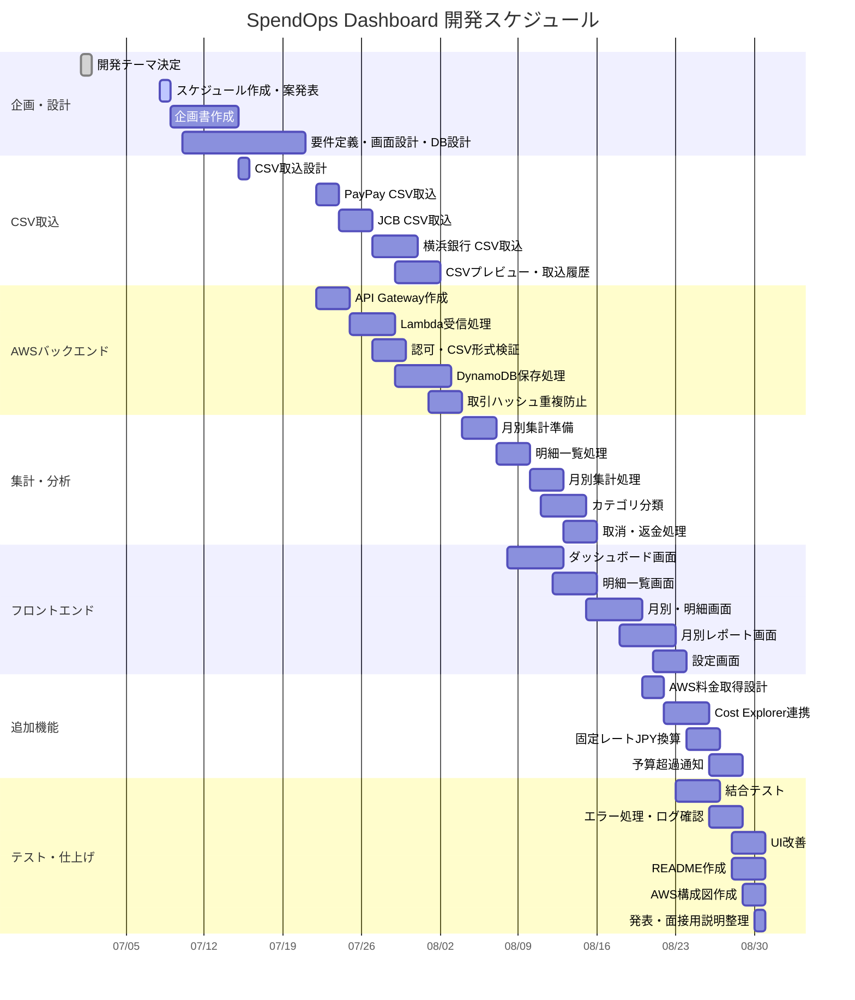

# 2026-07-08 最新方針

PayPay、横浜銀行、JCBカードは、初期版ではすべてCSVアップロード方式に統一する。ユーザーが任意のタイミングでCSVをアップロードし、その日までの暫定分析を月別レポートへ反映する。取引データは日付単位で保存するが、分析・画面表示は月別を中心にする。横浜銀行は支出ではなく入出金履歴として別枠で扱う。

---
# 2026-07-08 最新方針 v2

個人用の家計簿・資産管理ダッシュボードから、**複数人の収支CSVを収集して分析する比較分析サービス**へ要件を変更する。

利用者はCognitoでログインし、各自がPayPay、クレジットカード、銀行などのCSVをアップロードする。システムはCSVを共通形式へ正規化し、個人別の月次集計と、匿名化された全体集計を作成する。

このサービスの目的は、他人の明細を閲覧することではない。個人の収支傾向を、全体平均、中央値、分位、カテゴリ比率などの統計値と比較し、自分の支出傾向や位置づけを把握できるようにする。

## 新しいサービス概要

```text
複数人のCSV
        ↓
Cognitoログイン
        ↓
CSVアップロード
        ↓
CSV形式判定
        ↓
正規化
        ↓
個人別月次集計
        ↓
匿名化された全体集計
        ↓
本人向け比較分析 / 管理者向け全体分析
```

## ユーザー種別

| 種別 | できること | 見せないもの |
|---|---|---|
| 一般ユーザー | 自分のCSVアップロード、自分の明細確認、自分の集計確認、全体平均との差確認 | 他人の明細、他人の氏名、他人のCSV |
| 管理者 | 全体集計、取込状況、エラー状況、匿名化された傾向分析 | 原則として個人の生明細、カード番号、口座情報 |

## MVPで集計する項目

| 集計項目 | 目的 |
|---|---|
| 月間支出総額 | 個人と全体平均との差を比較する |
| 月間収入総額 | 取得できる場合のみ収支分析に使う |
| カテゴリ別支出 | 食費、交通費、日用品、娯楽、固定費などの偏りを見る |
| 支払い方法別支出 | PayPay、カード、銀行などの利用傾向を見る |
| 取引件数 | 利用頻度を見る |
| 前月比 | 個人内の変化を見る |
| 全体平均との差 | 集団内の位置づけを見る |
| 中央値・分位 | MVPでは対象外。利用者数が増えてから追加する |

## AWSを使う理由

| AWS要素 | 利用理由 |
|---|---|
| Cognito | 一般ユーザーと管理者のログイン分離 |
| API Gateway | 認証済みCSVアップロードAPI |
| Lambda | CSV検証、正規化、集計処理 |
| S3 | CSV原本の保存。KMS暗号化、非公開設定 |
| DynamoDB | 正規化済み取引、月次集計、比較集計の保存 |
| EventBridge | 月次集計や再集計の定期実行 |
| CloudWatch | エラー監視、監査ログ |
| IAM | 最小権限の実現 |
| KMS | CSVや集計データの暗号化 |

## セキュリティ方針

- 他人の生明細を表示しない
- 比較分析は匿名化された集計値だけで行う
- CSV原本、正規化済み取引、個人別月次集計、比較用匿名集計を分ける
- CSV原本はS3に非公開で保存し、KMSで暗号化する
- CloudWatch LogsにCSV全文、カード番号、口座番号、認証情報を出力しない
- 管理者画面でも個人特定につながる情報の表示を最小化する
- 比較対象の人数が少ない場合は、平均や分位を表示しない設計にする

## 対象外にする機能

AWS Cost ExplorerによるAWS料金取得は初期版から削除する。

理由は、今回のサービス価値が複数人の収支CSVを集めた比較分析にあり、利用者数が少ない段階ではAWS料金を集計しても比較対象として成立しにくいため。AWSは分析対象ではなく、認証、保存、集計、監査、暗号化のための実行基盤として使う。

## 2026-07-08 追加決定

### 初期対応CSV

csvフォルダ内の確認結果から、初期版では以下の3種類のCSV分析を行う。

| データソース | 文字コード | 取込上の注意 |
|---|---|---|
| PayPay | UTF-8 | 1行目にヘッダーあり。取引日、出金、入金、取引内容、取引先、取引方法、取引番号を利用できる |
| JCB | Shift_JIS | 先頭に支払日や合計金額のメタ情報があり、明細ヘッダー行まで読み飛ばす必要がある |
| 三井住友VISA | Shift_JIS | 先頭にカード情報を含むメタ情報があり、明細行は固定列として扱う必要がある |

### 管理者権限

管理者もセキュリティの観点から、個人情報や生明細は閲覧できない。

管理者が行えるのは以下に限定する。

- 全体集計の確認
- 取込状況の確認
- エラー件数の確認
- エラー原因ファイルの特定
- 失敗行番号と理由の確認

### 保存方針

- 原本CSVは保存しない
- 取込時にCSVを読み取り、加工後の正規化済みデータだけ保存する
- 氏名は削除する
- 支出先、摘要、取引内容はカテゴリ分類に必要なため保存する
- CSV全文、カード番号、口座情報、認証情報は保存しない

### 同意取得

ユーザー登録時に、収支データを匿名化・集計して比較分析に利用することへの同意を取る。

### 退会時のデータ削除

退会したユーザーのデータは、本人に紐づく正規化済み取引、個人別集計、ユーザー情報を削除する。個人を再識別できない全体集計だけ残す。

この方針は、プライバシー保護を重視するサービス設計として説明しやすく、退会後も個人が特定されるデータを残さないため安全性が高い。

### CSV取込エラー

CSV取込は部分取込を許可する。

該当行の取得に失敗した場合は、その行だけ除外し、それ以外の行で集計を行う。画面には「何行目のデータの取得に失敗したため、それ以外で集計を行います」と表示する。

### 比較対象

初期版では同じデータソース同士で比較する。

例:

- PayPay利用者同士
- JCB利用者同士
- VISA利用者同士

最終的には、すべての支出を統合した全支出比較を作成する。

## 新しい実装優先順位

1. Cognitoログインとユーザー種別分離
2. CSVアップロード
3. CSV形式判定
4. 正規化済み取引データ保存
5. 個人別月次集計
6. 全体集計
7. 匿名化された比較分析
8. 管理者向け取込状況・エラー確認

---

# SpendOps Dashboard 開発計画書

## 0. Codexへの指示

このMarkdownの内容をもとに、Notionに整理された開発ドキュメントを作成してください。

Notionでは以下のページ構成にしてください。

1. プロジェクト概要
2. 開発目的・背景
3. アプリの全体像
4. システム構成
5. 機能一覧
6. 決定事項
7. 未解決課題
8. DB設計
9. CSV取込設計
10. AWS設計
11. 画面設計
12. セキュリティ設計
13. 開発スケジュール
14. 面接での説明内容
15. 次にやること

表にできる部分はNotionのテーブル形式にしてください。
チェックリストにできる部分はToDo形式にしてください。
構成図はMermaid、またはテキスト図として見やすく整形してください。

---

# 1. プロジェクト概要

## アプリ名

候補：

- SpendOps Dashboard
- Personal Cost Analyzer
- Life Cost Dashboard
- Life & Cloud Cost Manager

現時点では **SpendOps Dashboard** を仮称とする。

## 概要

PayPay、横浜銀行、JCBカードのCSVをユーザーが任意のタイミングでアップロードし、AWSへ送信する。  
AWS側ではAPI Gateway、Lambda、S3、DynamoDBを使って明細データを保存し、月別の支出を集計する。

また、余裕があればAWS Cost Explorer APIを使ってAWS利用料金も取得し、日常支出とクラウド利用料金をまとめて可視化する。

## コンセプト

AWSのコスト分析だけでは用途が限定的になるため、日常の支出とAWS利用料金をまとめて分析できるシステムにする。

単なる家計簿ではなく、以下を重視する。

- 支払いCSVの自動取得
- 手作業を極力減らした支出集計
- AWSサーバーレス構成
- セキュリティに配慮した金融情報の扱い
- 月別の可視化
- 月別レポートによる振り返り
- NHNテコラスの事業内容に近い「コスト可視化」「データ活用」「自動化」「クラウド運用」の要素を含める

---

# 2. 開発目的・背景

## 背景

NHNテコラスへの就職を意識し、同社の事業内容と近いテーマでAWSを使った個人開発を行いたい。

NHNテコラスはクラウド活用、クラウド運用、コスト最適化、FinOps、データ活用、セキュリティなどに関わる事業を行っている。  
そのため、AWSを利用した「コスト可視化」「支出分析」「自動化」をテーマにした開発は志望先との関連性を説明しやすい。

## 解決したい課題

日常の支出はPayPay、クレジットカード、銀行など複数のサービスに分散している。  
そのため、月別でどのくらい使ったかを把握しにくい。

また、AWSを使った個人開発を進める中で、AWS利用料金も別で管理する必要がある。

そこで、生活費とAWS利用料金をまとめて可視化し、支出状況を自動集計できる仕組みを作る。

## 目標

- 会計後に届くCSVをもとに支出を自動記録する
- ユーザーが任意のタイミングでCSVをアップロードし、その日までの分析を確認できるようにする
- 取引データは日付単位で保存し、画面では月別集計を中心に表示する
- 支払い方法別、カテゴリ別に支出を分析する
- 月別レポートで支出の振り返りを行う
- AWSサーバーレス構成を使って実装する
- 金融情報を扱うため、必要最小限の情報のみ保存する

---

# 3. 対象サービス

初期段階では、以下の3社に絞る。

| 対象 | 用途 | 取得方法 |
|---|---|---|
| PayPay | キャッシュレス支払い | CSVアップロード |
| 横浜銀行 | 銀行口座の入出金履歴 | CSVアップロード |
| JCBカード | クレジットカード利用明細 | CSVアップロード |

## 理由

最初から多くのサービスに対応すると、メール形式の違いにより実装が複雑になる。  
そのため、まずは自分が実際に利用している3社に限定し、確実に動く仕組みを作る。

---

# 4. 全体構成

## 支出データ連携フロー

```text
PayPay / 横浜銀行 / JCBカード
        ↓
各サービスからCSVを取得
        ↓
ユーザーが任意のタイミングでアップロード
        ↓
CSVから日付・金額・店舗名または摘要・取引種別を抽出
        ↓
CSVプレビューで確認
        ↓
API GatewayへPOST
        ↓
Lambdaで認可とCSV形式を検証
        ↓
S3 / DynamoDBに保存
        ↓
月別集計
        ↓
Webダッシュボードで表示
```

## AWS料金連携フロー

```text
EventBridge
        ↓
Lambda
        ↓
Cost Explorer API
        ↓
AWS利用料金を取得
        ↓
固定レートでJPY換算
        ↓
DynamoDBに保存
        ↓
月別レポートに反映
```

---

# 5. 使用技術・AWSサービス

| 分類 | 使用技術・サービス | 役割 |
|---|---|---|
| CSV取込 | Browser Upload | PayPay、横浜銀行、JCBカードのCSVをアップロード |
| CSVプレビュー | Next.js | 取込前に明細内容を確認 |
| フロントエンド | React / Next.js など | ダッシュボード表示 |
| 静的ホスティング | S3 + CloudFront | フロントエンド配信 |
| 認証 | Cognito | ユーザーログイン |
| API | API Gateway | CSV取込やフロントからのリクエスト受付 |
| 処理 | Lambda | データ保存、集計、分類 |
| DB | DynamoDB | 明細・集計・取引ハッシュ保存 |
| ファイル保存 | S3 | 必要に応じてCSVやレポート保存 |
| 定期実行 | EventBridge | AWS料金取得や集計処理 |
| AWS料金取得 | Cost Explorer API | AWS利用料金の取得 |
| 通知 | SES / SNS | 予算超過や月次レポート通知 |
| ログ監視 | CloudWatch Logs | LambdaやAPIのログ確認 |
| 権限管理 | IAM | 最小権限でAWSサービスを利用 |

---

# 6. 決定事項

| No | 項目 | 決定内容 |
|---:|---|---|
| 1 | 初期対象サービス | PayPay、横浜銀行、JCBカード |
| 2 | メール形式の違い | 3社ごとに解析ルールを作成 |
| 3 | 重複対策 | CSVの取引IDまたは取引ハッシュとimportBatchIdを保存 |
| 4 | 返金・取消 | 取消として扱い、マイナス金額で保存 |
| 5 | カテゴリ分類 | ルールベースで分類 |
| 6 | AWS料金の円換算 | 固定レートでJPY換算 |
| 7 | 任意取込 | ユーザーが任意のタイミングでCSVをアップロードし、取込結果を確認 |
| 8 | API認証 | Cognito認証または認可済みリクエスト |
| 9 | 個人情報対策 | 必要最小限の情報だけ保存 |
| 10 | CSV保存 | CSV全文や不要な個人情報を必要以上に保存しない |
| 11 | 画面 | 最低限の画面に加えて月別レポートを作成 |
| 12 | 開発期間 | 2か月 |
| 13 | 開発時間 | 7月中は毎週水曜日に6時間、そのほか適宜確保 |
| 14 | CSV運用 | 各サービスからCSVを取得し、アップロードする運用に統一 |

---

# 7. 未解決課題

## 7.1 各社メールの実際の本文形式

PayPay、横浜銀行、JCBカードのCSVカラム名、文字コード、取消・返金表現を確認する必要がある。

確認項目：

- 送信元メールアドレス
- 件名
- 金額の書かれ方
- 利用日時の書かれ方
- 支払先の有無
- 取消・返金メールの形式
- 入金・出金の判定方法

## 7.2 横浜銀行CSVで取得できる情報

横浜銀行CSVでは、入金、出金、振替、摘要を確認し、支出ではなく入出金履歴として別枠で扱う。

対応方針：

- 取得できる範囲で保存する
- 支払先が不明な場合は `merchant = 不明` とする
- `source = YokohamaBank`
- `category = 銀行` または `未分類`

## 7.3 JCB CSVの速報・確定・取消の扱い

JCBカードCSVでは、速報、確定、取消がどのように表現されるかを確認する。

初期方針：

- 利用CSVを支出として登録
- 確定明細は初期段階では扱わない
- 取消メールが来た場合は `cancel` として相殺

## 7.4 AWS料金連携の実装タイミング

Cost Explorer API連携はできれば入れたいが、優先度は生活費集計より低い。

方針：

1. 生活費集計を先に完成させる
2. 余裕があればAWS Cost Explorer連携を追加
3. 難しければAWS料金は手動登録またはサンプルデータから始める

## 7.5 月別レポートの表示内容

月別レポートにどこまで含めるかは今後調整する。

候補：

- 今月の総支出
- 前月比
- 1日平均支出
- 最も支出が多いカテゴリ
- 最も使った支払い方法
- AWS利用料金
- 予算との差
- 取消・返金額
- 今月の振り返りコメント

---

# 8. CSV取込設計

## CSV取込の役割

CSV取込機能は以下の処理を行う。

1. アップロードされたCSVファイルを受け取る
2. PayPay、横浜銀行、JCBカードのCSVを判定
3. CSVから必要項目を抽出
4. JSONに整形
5. API GatewayへPOST送信
6. 成功したら取込結果とimportBatchIdを保存
7. 失敗したら処理済みにせず、次回実行で再送

## 定期実行

CSV取込はユーザーが任意のタイミングで実行する。

理由：

- 支払いタイミングが不定期でも取りこぼしにくい
- 1回送信に失敗しても30分後に再試行できる
- 1〜2時間以内に反映される可能性が高い
- 次の支払いまで反映されない問題を避けられる

## 成功時の処理

```text
ユーザーがCSVアップロード
↓
AWSへ送信
↓
LambdaがDynamoDBに保存
↓
成功レスポンスを返す
↓
取込結果とimportBatchIdを保存する
```

## 失敗時の処理

```text
ユーザーがCSVアップロード
↓
AWSへ送信
↓
通信エラーまたはLambdaエラー
↓
失敗時は取込済みとして扱わない
↓
次回30分後の実行で再送
```

## CSVソース設計

最低限必要なラベル：

- import/succeeded
- spendops/error

余裕があれば追加：

- source/paypay
- spendops/yokohama-bank
- source/jcb

## CSV取込APIへ送信するJSON例

```json
{
  "importBatchId": "csv-import-batch-id",
  "source": "PayPay",
  "date": "2026-07-01",
  "amount": 850,
  "merchant": "コンビニ",
  "paymentMethod": "PayPay",
  "type": "expense"
}
```

---

# 9. DynamoDB設計

## transactions テーブル

支払い明細を保存するテーブル。

| 項目 | 型 | 内容 |
|---|---|---|
| userId | String | ユーザーID |
| transactionId | String | アプリ側で生成する取引ID |
| importBatchId | String | CSV取込単位のID |
| source | String | PayPay / YokohamaBank / JCB / AWS |
| date | String | 利用日 |
| amount | Number | 金額 |
| merchant | String | 支払先 |
| category | String | カテゴリ |
| paymentMethod | String | 支払い方法 |
| type | String | expense / cancel / income |
| createdAt | String | 登録日時 |

### 重複対策

同じ取引ハッシュまたはCSV内取引IDが既に保存されている場合は登録しない。

将来的には以下も組み合わせる。

- transactionHash または CSV内取引ID
- date
- amount
- source

## daily_summary テーブル

月別集計を保存するテーブル。

| 項目 | 型 | 内容 |
|---|---|---|
| userId | String | ユーザーID |
| date | String | 集計日 |
| totalAmount | Number | 合計支出 |
| paypayAmount | Number | PayPay支出 |
| jcbAmount | Number | JCB支出 |
| bankAmount | Number | 横浜銀行関連 |
| awsAmount | Number | AWS料金 |
| foodAmount | Number | 食費 |
| transportAmount | Number | 交通費 |
| learningAmount | Number | 学習費 |
| cloudAmount | Number | クラウド費用 |

## monthly_summary テーブル

月別レポート用の集計を保存するテーブル。

| 項目 | 型 | 内容 |
|---|---|---|
| userId | String | ユーザーID |
| month | String | 対象月 |
| totalAmount | Number | 月の総支出 |
| previousMonthDiff | Number | 前月との差額 |
| dailyAverage | Number | 1日平均支出 |
| topCategory | String | 最も支出が多いカテゴリ |
| topPaymentMethod | String | 最も利用した支払い方法 |
| awsAmount | Number | AWS利用料金 |
| cancelAmount | Number | 取消・返金額 |
| reportComment | String | 振り返りコメント |

## category_rules テーブル

カテゴリ分類ルールを保存するテーブル。

| 項目 | 型 | 内容 |
|---|---|---|
| keyword | String | 判定キーワード |
| category | String | 分類カテゴリ |
| priority | Number | 優先度 |

例：

| keyword | category |
|---|---|
| セブン | 食費 |
| ローソン | 食費 |
| ファミマ | 食費 |
| JR | 交通費 |
| Amazon | 日用品 |
| AWS | クラウド費用 |
| Udemy | 学習費 |

---

# 10. AWS設計

## API Gateway

ブラウザからアップロードされたCSVデータを受け取るエンドポイントを作成する。

例：

```text
POST /transactions/import
```

## Lambda

Lambdaでは以下を行う。

1. 認可とCSV形式を検証
2. JSONの形式チェック
3. 取引ハッシュまたはCSV内取引IDで重複確認
4. カテゴリ分類
5. 返金・取消の判定
6. DynamoDBへ保存
7. 成功または失敗レスポンスを返す

## API認証方式

ブラウザからAPI Gatewayへ送信するとき、Cognito認証または認可済みリクエストで保護する。

例：

```text
x-api-token: xxxxxxxxxxxxxxxxx
```

Lambda側では、環境変数に保存したトークンと比較する。

一致しない場合は拒否する。

```text
401 Unauthorized
```

## EventBridge

以下の定期処理に使用する。

- AWS料金の取得
- 月別集計の再計算
- 月別レポートの作成
- 予算超過通知

## Cost Explorer API

余裕があれば、AWS利用料金を取得する。

流れ：

```text
EventBridge
↓
Lambda
↓
Cost Explorer API
↓
固定レートでJPY換算
↓
DynamoDBに保存
```

---

# 11. 画面設計

## 11.1 ダッシュボード画面

表示内容：

- 今日の支出
- 今週の支出
- 今月の支出
- 前月比
- カテゴリ別支出
- 支払い方法別支出
- AWS利用料金

## 11.2 日別支出画面

表示内容：

- 日付ごとの合計金額
- その日の明細一覧
- 支払い方法別内訳

## 11.3 週別支出画面

表示内容：

- 週ごとの合計
- 前週比
- カテゴリ別内訳
- 支払い方法別内訳

## 11.4 月別支出画面

表示内容：

- 月ごとの合計
- 前月比
- PayPay / 横浜銀行 / JCB / AWS の内訳
- カテゴリ別グラフ

## 11.5 月別レポート画面

表示内容：

- 今月の総支出
- 前月との差
- 1日平均支出
- 最も支出が多いカテゴリ
- 最も利用回数が多い支払い方法
- AWS利用料金
- 予算との差
- 取消・返金額
- 今月の振り返りコメント

## 11.6 明細一覧画面

表示内容：

- 日付
- 金額
- 支払い方法
- 支払先
- カテゴリ
- type
- source

## 11.7 設定画面

表示内容：

- 固定為替レート
- 月予算
- カテゴリルール
- 通知設定

---

# 12. セキュリティ設計

## 保存しない情報

以下の情報は保存しない。

- カード番号
- ログインID
- パスワード
- 認証コード
- CSV全文や不要な個人情報
- 住所
- 電話番号

## 保存する情報

必要最小限の情報のみ保存する。

- 日付
- 金額
- 支払い元
- 支払先
- カテゴリ
- importBatchId
- 登録日時

## セキュリティ上の工夫

- CSV内の不要な個人情報を保存しない
- 取込前にCSVプレビューを表示する
- API Gatewayへの送信はCognito認証または認可済みリクエストで保護する
- 秘密情報は環境変数で扱い、コードに直書きしない
- DynamoDBにはCSV全文を保存しない
- IAM権限は必要最小限にする
- CloudWatch Logsでエラーを確認できるようにする

## 面接で説明できるポイント

金融情報を扱うため、カード番号やログイン情報、CSV全文は必要以上に保存せず、日付・金額・支払先など必要最小限の情報のみを扱う設計にした。

また、CSVアップロード方式に統一し、メール本文を扱わない設計にした。  
ブラウザからAWSへ送信するAPIはCognito認証または認可済みリクエストで保護する。

---

# 13. 開発優先順位

## 必ず完成させる範囲

- CSVアップロード画面作成
- PayPay CSV取込
- 横浜銀行 CSV取込
- JCBカード CSV取込
- Browser UploadからAPI Gatewayへ送信
- Lambdaで認可とCSV形式を検証
- DynamoDB保存
- 取引ハッシュとimportBatchIdによる重複防止
- 月別集計
- 明細一覧
- 月別集計
- 明細一覧
- 月別レポート

## できれば入れたい範囲

- カテゴリ自動分類
- 取消処理
- エラー時の再送
- CloudWatch Logs確認
- 固定レートJPY換算
- AWS Cost Explorer連携

## 余裕があれば入れる範囲

- 予算超過通知
- 月次レポートの自動メール送信
- S3へのCSVバックアップ
- グラフ改善
- IaC化
- デモ動画作成

---

# 14. 8週間の開発スケジュール

## 1週目：設計

- 要件定義
- 対象3社のCSVサンプル確認
- DB設計
- AWS構成図作成
- 画面設計

## 2週目：CSV取込実装

- CSVアップロード画面作成
- CSVプレビュー作成
- PayPay CSV取込
- JCB CSV取込
- 横浜銀行 CSV取込
- 取込結果表示
- 取込履歴保存

## 3週目：AWS受信処理

- API Gateway作成
- Lambda作成
- 認可とCSV形式の検証
- DynamoDB保存
- transactionHash または CSV内取引ID重複チェック
- CloudWatch Logs確認

## 4週目：集計処理

- 月別集計
- 明細一覧
- 月別集計
- 取消処理
- カテゴリ分類

## 5週目：フロントエンド

- ダッシュボード画面
- 明細一覧画面
- 日別支出画面
- 週別支出画面
- 月別支出画面

## 6週目：月別レポート

- 月別レポート画面
- 前月比
- カテゴリ別分析
- 支払い方法別分析
- 1日平均支出

## 7週目：AWS料金・通知・エラー処理

- Cost Explorer連携
- 固定レートJPY換算
- CSV取込再送処理
- エラーラベル管理
- ログ確認

## 8週目：仕上げ

- UI改善
- README作成
- AWS構成図作成
- デモ動画作成
- 面接用説明文作成

---

# 15. 実装の進め方

最初から3社すべてを同時に作るのではなく、1社で縦に完成させる。

推奨順序：

1. PayPayだけで一連の流れを完成
2. JCBを追加
3. 横浜銀行を追加
4. 月別集計を完成
5. 月別レポートを作成
6. AWS料金を追加

---

# 16. 面接での説明例

AWSのコスト分析だけでは用途が限定的だと考え、日常の支出とAWS利用料金をまとめて可視化する支出分析システムを作成しました。

PayPay、横浜銀行、JCBカードのCSVをユーザーが任意のタイミングでアップロードし、AWSへ連携します。  
AWS側ではAPI GatewayとLambdaでデータを受け取り、DynamoDBに保存します。  
CSVの取引IDまたは取引ハッシュとimportBatchIdを保存することで重複登録を防ぎ、月別の支出を集計できるようにしました。

金融情報を扱うため、カード番号やログイン情報、CSV全文は必要以上に保存せず、日付・金額・支払先など必要最小限の情報のみを扱う設計にしました。  
また、API Gatewayへの送信はCognito認証または認可済みリクエストで保護し、外部からの不正送信を防ぐようにしました。

この開発を通して、AWSのサーバーレス構成、データ連携、自動化、セキュリティを意識した設計を学びました。

---

# 17. NHNテコラスとの関連性

この開発は、NHNテコラスの事業内容と以下の点で関連する。

| NHNテコラスの事業に近い要素 | この開発での対応 |
|---|---|
| クラウド活用 | AWSを使ったサーバーレス構成 |
| コスト可視化 | 日常支出とAWS利用料金の可視化 |
| FinOps | コストを集計・分析して改善に活かす |
| データ活用 | CSVを解析し、支出データとして活用 |
| 任意取込 | CSVアップロードとAWSを連携し、月別分析に集中 |
| セキュリティ | 必要最小限の金融情報のみ保存 |
| 運用 | CloudWatch Logsでエラー確認、定期実行で再送 |

---

# 18. 次にやること

## 直近の作業

- [ ] CSVアップロード画面を作成する
- [ ] PayPay CSVを取り込めるようにする
- [ ] 横浜銀行 CSVを取り込めるようにする
- [ ] JCBカード CSVを取り込めるようにする
- [ ] 各社のCSV本文を確認する
- [ ] 金額・日付・支払先の抽出ルールをメモする
- [ ] PayPayからCSV取込を開始する

## メール確認時にメモする項目

各社ごとに以下を記録する。

| 項目 | 内容 |
|---|---|
| サービス名 | PayPay / 横浜銀行 / JCB |
| 送信元メールアドレス | 実際のFrom |
| 件名 | CSVの件名 |
| 金額の記載 | 例：1,200円 |
| 日付の記載 | 例：2026年7月1日 12:30 |
| 支払先の記載 | 例：セブンイレブン |
| 取消・返金通知 | あるかどうか |
| 解析しやすさ | 高 / 中 / 低 |
| 備考 | 注意点 |

---

# 19. 最終方針まとめ

```text
対象は PayPay・横浜銀行・JCBカード の3社
3社ともCSVアップロード方式に統一する
ユーザーが任意のタイミングでアップロードする
アップロード済みデータでその日までの暫定分析を表示する
DynamoDBに取引ハッシュとimportBatchIdを保存して重複防止
API GatewayはCognito認証または認可済みリクエストで保護
返金・取消は cancel として扱う
横浜銀行は支出ではなく入出金履歴として別枠で扱う
カテゴリはルールベース
月別レポート画面を最優先で作る
2か月で完成を目指す
```


---

# 20. 授業スケジュールとの対応

## 授業内の大まかな予定

以下の授業スケジュールに合わせて開発を進める。

| 回 | 日付 | 授業内容 | SpendOps Dashboardでやること |
|---:|---|---|---|
| 9 | 7月1日 | オリエンテーション・制作企画 | 開発テーマの方向性決定 |
| 10 | 7月8日 | スケジュール作成・制作システム制作案発表 | 開発計画・構成案・ガントチャート作成 |
| 11 | 7月15日 | 企画書作成 | 企画書、要件定義、画面設計、DB設計を整理 |
| 12 | 7月22日 | 制作1：プログラミング開発 | PayPay CSV取込、AWS受信処理の実装開始 |
| 13 | 7月29日 | 制作2：プログラミング開発 | DynamoDB保存、重複防止、集計処理の実装 |
| 14以降 | 8月中 | 制作期間 | すべて開発期間として利用する |

## 方針

7月前半は、企画・設計・発表準備を中心に進める。  
7月22日以降はプログラミング開発に入り、8月中の予定はすべて開発期間に当てる。

8月は実装・テスト・改善・ドキュメント作成を細かく分けて進める。

---

# 21. Codexへの追加指示：ガントチャート作成

Codexは、Notionに以下の内容を追加してください。

## 追加してほしいページ

- 開発スケジュール
- ガントチャート
- タスク管理
- 進捗管理

## ガントチャート作成の条件

Notion上で、以下の内容が分かるガントチャートを作成してください。

- 7月1日〜8月末までの全体スケジュール
- 授業内スケジュールとの対応
- 設計期間
- CSV取込実装期間
- AWS実装期間
- DynamoDB設計・実装期間
- 集計処理実装期間
- フロントエンド実装期間
- 月別レポート実装期間
- AWS料金連携期間
- テスト・修正期間
- README・構成図・発表資料作成期間

Notionでガントチャートを直接作れない場合は、以下のどちらかで作成してください。

1. Notionのデータベーステーブルで、開始日・終了日・ステータス・優先度を持つタスク表を作成する
2. Mermaidのgantt記法でガントチャートを作成する

## Mermaidガントチャート例



---

# 22. 細分化した開発タスク

## 22.1 企画・設計フェーズ

| タスク | 期間 | 優先度 | 内容 |
|---|---|---|---|
| 開発テーマ確定 | 7月1日 | 高 | SpendOps Dashboardに決定 |
| 対象サービス確定 | 7月1日〜7月8日 | 高 | PayPay、横浜銀行、JCBに絞る |
| スケジュール作成 | 7月8日 | 高 | 授業内発表用スケジュールを作成 |
| 企画書作成 | 7月8日〜7月15日 | 高 | 背景、目的、機能、構成を整理 |
| AWS構成図作成 | 7月10日〜7月21日 | 高 | API Gateway、Lambda、DynamoDB、S3等の構成 |
| DB設計 | 7月10日〜7月21日 | 高 | transactions、summary、category_rules設計 |
| 画面設計 | 7月10日〜7月21日 | 高 | ダッシュボード、明細、月別レポート |

## 22.2 CSV取込フェーズ

| タスク | 期間 | 優先度 | 内容 |
|---|---|---|---|
| CSV取込設計 | 7月15日〜7月16日 | 高 | 3サービスのCSV取込方式を設計 |
| CSVサンプル確認 | 7月15日〜7月18日 | 高 | 3社のCSVカラムと文字コードを確認 |
| PayPay CSV取込 | 7月22日〜7月24日 | 高 | 金額、日付、店舗名を取り込む |
| JCB CSV取込 | 7月24日〜7月27日 | 高 | 利用明細から必要情報を取り込む |
| 横浜銀行 CSV取込 | 7月27日〜7月31日 | 中 | 入出金履歴を取り込む |
| CSVプレビュー・取込履歴 | 7月29日〜8月2日 | 高 | 取込前確認と履歴表示を作成 |
| 取込履歴保存 | 7月29日〜8月2日 | 高 | 成功・重複・エラー件数を保存する |
| 再送処理 | 7月29日〜8月2日 | 高 | 失敗時は次回実行で再送 |

## 22.3 AWSバックエンドフェーズ

| タスク | 期間 | 優先度 | 内容 |
|---|---|---|---|
| API Gateway作成 | 7月22日〜7月25日 | 高 | POST /transactions/import |
| Lambda作成 | 7月25日〜7月29日 | 高 | ブラウザからのCSVデータを受信 |
| 認可・CSV形式検証 | 7月27日〜7月30日 | 高 | 認可とCSV形式を検証 |
| DynamoDB作成 | 7月29日〜8月1日 | 高 | 明細・集計用テーブル |
| DynamoDB保存処理 | 7月29日〜8月3日 | 高 | 取引データ保存 |
| 取引ハッシュ重複防止 | 8月1日〜8月4日 | 高 | 同じCSV明細を二重登録しない |
| CloudWatch Logs確認 | 8月1日〜8月5日 | 中 | エラー確認・ログ整備 |

## 22.4 集計・分析フェーズ

| タスク | 期間 | 優先度 | 内容 |
|---|---|---|---|
| 月別集計準備 | 8月4日〜8月7日 | 高 | 日付単位データから月別集計を作る |
| 明細一覧処理 | 8月7日〜8月10日 | 高 | 月別集計から明細へ遷移できるようにする |
| 月別集計 | 8月10日〜8月13日 | 高 | 月ごとの合計・前月比 |
| カテゴリ分類 | 8月11日〜8月15日 | 高 | ルールベースで分類 |
| 取消・返金処理 | 8月13日〜8月16日 | 中 | cancelをマイナス計上 |
| 月別レポート集計 | 8月16日〜8月20日 | 高 | 月次レポート用データ作成 |

## 22.5 フロントエンドフェーズ

| タスク | 期間 | 優先度 | 内容 |
|---|---|---|---|
| プロジェクト作成 | 8月5日〜8月7日 | 高 | React / Next.js 初期構築 |
| ダッシュボード画面 | 8月8日〜8月13日 | 高 | 今日・今週・今月の支出表示 |
| 明細一覧画面 | 8月12日〜8月16日 | 高 | 取引明細の一覧表示 |
| 明細一覧画面 | 8月15日〜8月18日 | 高 | 取引明細を一覧表示 |
| 取込履歴画面 | 8月17日〜8月20日 | 中 | ソース別の取込履歴を表示 |
| 月別支出画面 | 8月18日〜8月22日 | 高 | 月別集計表示 |
| 月別レポート画面 | 8月18日〜8月23日 | 高 | レポート形式で表示 |
| 設定画面 | 8月21日〜8月24日 | 中 | カテゴリ、予算、固定レート設定 |

## 22.6 AWS料金・追加機能フェーズ

| タスク | 期間 | 優先度 | 内容 |
|---|---|---|---|
| AWS料金取得設計 | 8月20日〜8月22日 | 中 | Cost Explorerの取得項目を整理 |
| Cost Explorer連携 | 8月22日〜8月26日 | 中 | AWS利用料金を取得 |
| 固定レートJPY換算 | 8月24日〜8月27日 | 中 | USDをJPYに換算 |
| AWS料金の月別反映 | 8月25日〜8月28日 | 中 | 月別レポートに反映 |
| 予算超過通知 | 8月26日〜8月29日 | 低 | SES/SNSで通知 |

## 22.7 テスト・仕上げフェーズ

| タスク | 期間 | 優先度 | 内容 |
|---|---|---|---|
| CSV取込単体テスト | 8月20日〜8月23日 | 高 | 各社CSV取込を確認 |
| Lambda単体テスト | 8月22日〜8月25日 | 高 | 保存・重複防止を確認 |
| 結合テスト | 8月23日〜8月27日 | 高 | メール受信から画面表示まで確認 |
| エラー処理確認 | 8月26日〜8月29日 | 高 | 送信失敗時の再送確認 |
| UI改善 | 8月28日〜8月31日 | 中 | 表示崩れ・使いやすさ改善 |
| README作成 | 8月28日〜8月31日 | 高 | 使い方、構成、工夫点を記載 |
| AWS構成図作成 | 8月29日〜8月31日 | 高 | draw.io等で作成 |
| デモ動画作成 | 8月30日〜8月31日 | 中 | 発表・面接用 |
| 面接用説明整理 | 8月30日〜8月31日 | 高 | NHNテコラス向け説明を整理 |

---

# 23. NotionタスクDB用フォーマット

Notionには以下のカラムを持つタスクDBを作成する。

| カラム名 | 種類 | 内容 |
|---|---|---|
| タスク名 | Title | 実装タスク名 |
| フェーズ | Select | 企画・設計 / CSV取込 / AWS / 集計 / フロント / 追加機能 / テスト |
| 開始日 | Date | 作業開始日 |
| 終了日 | Date | 作業終了日 |
| 優先度 | Select | 高 / 中 / 低 |
| ステータス | Select | 未着手 / 進行中 / 完了 / 保留 |
| 関連機能 | Multi-select | PayPay / JCB / 横浜銀行 / AWS料金 / 月別レポート 等 |
| メモ | Text | 注意点や実装方針 |

---

# 24. Codexへの最終追加指示

このMarkdownをNotionに記述するときは、開発期間の部分を大まかな週単位だけでなく、上記のように細分化してください。

また、Notionには以下を必ず作成してください。

- 授業スケジュールとの対応表
- 7月〜8月末までのガントチャート
- タスク管理テーブル
- フェーズ別のToDoリスト
- 未解決課題一覧
- 次にやることリスト

特にガントチャートは、開発全体の進捗が一目で分かるようにしてください。


